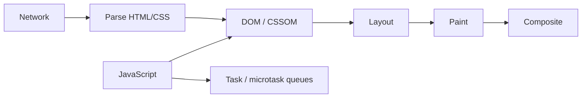

# Browser Runtime: Event Loop, Rendering ve Web Performance

Browser performansını anlamak için network, JavaScript runtime ve rendering pipeline birlikte düşünülmelidir.

## Event loop

JavaScript işleri task ve microtask queue'ları üzerinden ilerler. Uzun süren synchronous JavaScript ana thread'i bloke ederek input ve rendering gecikmesi yaratabilir.

## Rendering pipeline

- Parse: HTML/CSS yapıları oluşturulur.
- Layout: element geometry hesaplanır.
- Paint: görsel komutlar üretilir.
- Composite: layer'lar ekranda birleştirilir.

DOM okuma/yazmalarını kötü sırada yapmak gereksiz layout tekrarlarına neden olabilir.

## Mülakat soruları

1. Event loop nedir?
2. Promise callback ile `setTimeout(..., 0)` neden aynı sırada çalışmayabilir?
3. Layout/reflow ile repaint farkı nedir?
4. Büyük JS bundle kullanıcı deneyimini nasıl etkiler?
5. Debounce ve throttle farkı nedir?
6. Frontend memory leak nasıl oluşabilir?
7. LCP, INP ve CLS neyi ölçer?

## Lab

10.000 satırlık listeyi önce normal render et, sonra virtualization uygula. Browser performance panel ile scripting/rendering süresini ve input gecikmesini karşılaştır.

## Production bağlantısı

Long task, büyük bundle, yanlış cache policy, gereksiz rerender ve cleanup eksikliği doğrudan kullanıcı deneyimini etkileyebilir. Senior cevap ölçüm ve profiler üzerinden ilerlemelidir.

## Ana kaynaklar

- WHATWG HTML — Event loops: https://html.spec.whatwg.org/multipage/webappapis.html#event-loops
- MDN — JavaScript execution model: https://developer.mozilla.org/en-US/docs/Web/JavaScript/Event_loop
- web.dev — Web Vitals: https://web.dev/articles/vitals
