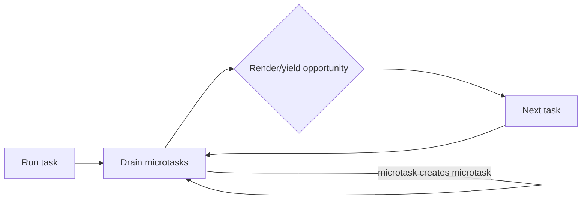

# Browser Runtime: Event Loop, Microtasks, Rendering ve Cooperative Scheduling

Browser performansını anlamak için network, JavaScript runtime, scheduler ve rendering pipeline birlikte düşünülmelidir.

## Event loop ve fairness

JavaScript task ve microtask queue'ları üzerinden ilerler. Promise callback'leri ve `queueMicrotask()` microtask'tır; mevcut task tamamlandıktan sonra bir sonraki task'tan önce microtask queue boşaltılır. Bir microtask sürekli yeni microtask üretirse timer, input ve rendering gecikebilir. Bu **microtask starvation** problemidir.

`Promise.resolve().then(loop)` ile işi bölmek scheduler'a gerçek anlamda yield etmek değildir. Uzun CPU işi worker'a taşınabilir; main-thread işi ise task/chunk sınırlarıyla cooperative biçimde dilimlenebilir.

## Rendering pipeline

Parse → DOM/CSSOM → layout → paint → composite akışında uzun synchronous JS ana thread'i tutarsa input ve frame üretimi gecikir. Kötü sıralanmış DOM read/write işlemleri gereksiz layout tekrarları da yaratabilir.

## Backend bağlantısı

Node.js'te de pahalı callback veya event-loop'u monopolize eden iş, bağımsız request'lerin tail latency'sini yükseltebilir. `async` sözcüğü CPU işini otomatik olarak non-blocking yapmaz.

## Mülakat soruları

1. Task ve microtask farkı nedir?
2. Promise callback neden `setTimeout(..., 0)` callback'inden önce çalışabilir?
3. Microtask starvation nasıl oluşur?
4. Long task rendering/input'u nasıl etkiler?
5. Chunking ile worker trade-off'u nedir?
6. LCP, INP ve CLS neyi ölçer?
7. Staff: event-loop lag ve fairness için hangi SLO/telemetry'yi kurarsın?

## Lab

CPU-bound bir döngüyü tek callback, recursive microtask, task-chunking ve worker ile çalıştır. Input delay, long-task duration, toplam throughput ve worker overhead'ini karşılaştır.

## Failure modes / production

Microtask'ı yield sanmak, sınırsız Promise zinciri, CPU işini main thread'de bırakmak ve yalnız average latency ölçmek yaygın hatalardır. Production'da INP/long tasks, event-loop lag, p95/p99 latency, queue depth ve worker utilization izlenmelidir.

## Ana kaynaklar

- WHATWG HTML — Event loops: https://html.spec.whatwg.org/multipage/webappapis.html#event-loops
- MDN — Microtask guide: https://developer.mozilla.org/en-US/docs/Web/API/HTML_DOM_API/Microtask_guide
- Node.js — Don't block the event loop: https://nodejs.org/en/learn/asynchronous-work/dont-block-the-event-loop
- web.dev — Web Vitals: https://web.dev/articles/vitals