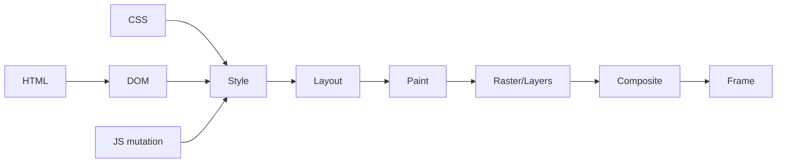

# Browser Rendering Pipeline: Layout, Paint & Compositing

## Konu anlatımı
Browser HTML/CSS/JS ve kaynakları pixel'lere dönüştürürken DOM/style, layout, paint, raster ve compositing aşamalarından geçer. Bir UI değişikliğinin maliyeti hangi aşamaları yeniden tetiklediğine bağlıdır. Layout geometriyi, paint çizim komutlarını, compositor ise layer sonuçlarının birleşimini yönetir.

`transform` ve `opacity` gibi bazı değişiklikler uygun koşullarda layout/paint'i atlayabilir; fakat GPU/compositor bedava değildir. Fazla layer memory, raster ve upload maliyeti yaratır. JS DOM write sonrası geometry read isterse pending style/layout senkron tamamlanabilir; read/write'ların döngüde karışması layout thrashing yaratır.

## Mental model

## İçeride ne oluyor?
- DOM/style değişiklikleri invalidation üretir.
- Layout box geometry hesaplar.
- Paint görsel çizim operasyonlarını oluşturur.
- Raster tile/pixel sonuçlarını üretir.
- Compositor layer'ları frame'e birleştirir.
- Forced synchronous layout main-thread latency'yi büyütebilir.
- 60 Hz'de yaklaşık 16.7 ms frame aralığını browser'ın tüm işi paylaşır.

## Mülakat soruları
1. Layout, paint ve composite farkı?
2. `transform` neden çoğu durumda `left/top` animasyonundan ucuz olabilir?
3. Forced synchronous layout nedir?
4. Layout thrashing nasıl azaltılır?
5. Fazla compositor layer neden sorun olabilir?
6. Lab ve gerçek-user metric'leri çelişirse nasıl triage edersin?

## Beklenen cevap derinliği
**Junior:** pipeline aşamaları. **Mid:** invalidation, frame budget, read/write batching. **Senior:** main-thread/compositor, raster ve layer memory trade-off'u. **Staff:** RUM, trace, device segmentation, percentile ve rollout/performance budget yaklaşımı.

## Mini alıştırma
100 elementte her iterasyonda style write + `offsetWidth` read yapan loop'u read ve write fazlarına ayır; DevTools Performance'ta Layout sayısı ve süresini karşılaştır.

## Proje fikri
`render-pipeline-lab`: aynı animasyonu `left`, `transform` ve canvas ile uygula; CPU throttling altında frame time, long task ve interaction latency ölç.

## Failure modes / trade-off / production
“Her şey compositor'da”, “will-change her yere” ve “60 FPS tek metriktir” yaklaşımları yanlıştır. Production'da INP/LCP/CLS, long tasks ve RUM device/network segmentleri release/canary ile birlikte değerlendirilmelidir.

## Kaynaklar
- Chrome for Developers — Blink: https://developer.chrome.com/docs/web-platform/blink
- Chrome performance docs: https://developer.chrome.com/docs/performance
- web.dev rendering performance: https://web.dev/articles/rendering-performance
- DevTools Performance: https://developer.chrome.com/docs/devtools/performance
