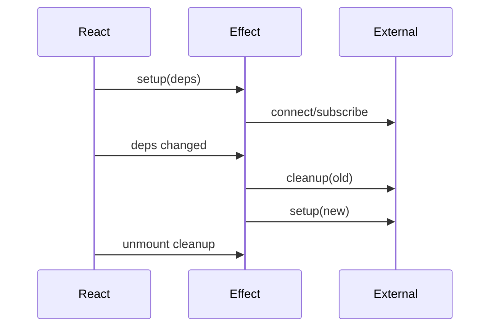

# React Effects, External Synchronization & Cleanup

`useEffect`, component'i network connection, timer, browser API veya üçüncü taraf widget gibi external system ile senkronize eder. Render sırasında türetilebilen state için Effect kullanmak çoğunlukla gereksizdir.

## Interview depth
Junior: setup/dependencies/cleanup. Mid: subscriptions ve timers. Senior: stale closure, race, abort/cancellation, custom hooks ve Effect elimination.

## Failure modes / production
Eksik cleanup resource leak; eksik dependency stale state; unstable object/function dependency reconnect storm; response-order race eski cevabın yeni state'i ezmesine yol açabilir.

## Alıştırma
`roomId` değişince eski websocket'i kapatıp yenisini açan component tasarla ve unmount cleanup ekle.

## Kaynaklar
- https://react.dev/reference/react/useEffect
- https://react.dev/learn/synchronizing-with-effects
- https://react.dev/learn/you-might-not-need-an-effect
