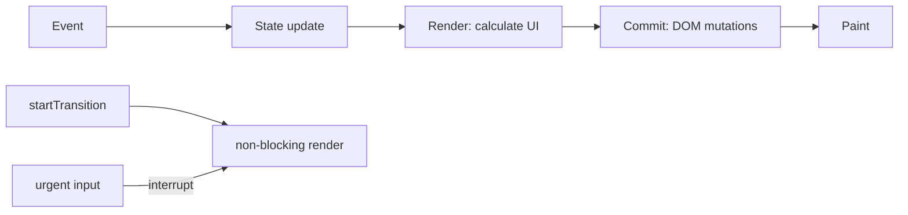

# React Render/Commit, Transitions & Responsiveness

**Seviye:** Junior → Staff  
**Alan:** Frontend

## Mental model
Bir state update önce UI sonucunun hesaplandığı render work'ünü tetikler; commit aşaması gereken DOM mutation'larını uygular; ardından browser paint gelir. Render tekrar çalıştırılabilir olmalıdır.

## Temel mekanikler
Render component fonksiyonlarından UI sonucunu hesaplar; commit gerçek DOM değişikliklerini uygular. Re-render her zaman DOM mutation demek değildir. `useTransition`, update'leri non-blocking Transition olarak işaretlemeye yarar; urgent update transition work'ünü interrupt edip yeniden başlatabilir. Controlled text input state synchronous kalmalıdır.

Async Actions/request'lerde sonuçların out-of-order gelmesi ayrı bir correctness problemidir; transition network cancellation veya ordering garantisi değildir. Versioning, abort/queue veya uygun yüksek-seviye abstraction gerekir.

React 19.3, 9 Eylül 2026'da yayımlandı ve `<ViewTransition>` stable oldu. View Transition görsel animasyon API'sidir; scheduling Transition kavramıyla karıştırılmamalıdır.

## Mülakat soruları
1. Render ile commit farkı nedir?
2. Re-render neden DOM update garantilemez?
3. Render purity neden önemlidir?
4. `useTransition` debounce mudur? Neden değil?
5. Controlled input neden Transition update olmamalıdır?
6. Pahalı chart/filter update'inde urgent ve non-urgent state'i nasıl ayırırsın?
7. Async transition sonuçlarında stale write'ı nasıl engellersin?

## Beklenen cevap derinliği
- **Junior:** trigger → render → commit → paint.
- **Mid:** purity, effects, pending UI ve transition.
- **Senior:** interruption, stale async results, Suspense ve profiling.
- **Staff:** interaction latency budget, router/framework scheduling boundary ve UX economics.

## Mini alıştırma
10.000 satırlık filtrelenebilir listede input state'i synchronous tut; pahalı sonucu transition ile güncelle. Eski async sonucun yeni sonucu ezmesini version/abort stratejisiyle engelle.

## Proje
Büyük dataset, search ve chart içeren bir `react-responsiveness-lab` oluştur. Normal update ve transition sürümlerinde interaction latency, commit duration ve dropped frames ölç.

## Failure modes ve production
Her update'i transition yapmak, transition'ı cancellation sanmak, render içine side effect koymak, stale response yazmak ve pending feedback vermemek tipik hatalardır. Production'da INP, long tasks, render/commit duration ve interaction correctness birlikte değerlendirilir.

## Kaynaklar
- React — Render and Commit: https://react.dev/learn/render-and-commit
- React — useTransition: https://react.dev/reference/react/useTransition
- React — startTransition: https://react.dev/reference/react/startTransition
- React 19.3 — 9 Sep 2026: https://react.dev/blog/2026/09/09/react-19-3
