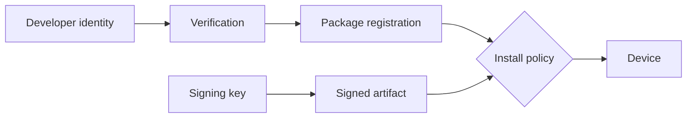

# Android Developer Verification & Distribution Trust

## Trust katmanlarını ayır

Mobil dağıtım güvenliğinde package identity, cryptographic signing, developer identity ve store/policy review farklı katmanlardır. APK signing update continuity ve artifact integrity için kritiktir; fakat signing key'in arkasındaki gerçek geliştirici kimliğini tek başına kanıtlamaz.

Android, developer verification korumalarını 30 Eylül 2026'da Brezilya, Endonezya, Singapur ve Tayland'daki certified Android cihazlarda başlatacağını; 2027'de global genişleme planladığını açıkladı. Verification bir malware detector değildir: provenance/accountability katmanı ekler.

## Mental model

## Mülakat derinliği

- Junior: package, signing key, install/update.
- Mid: trust chain, store vs sideload, key rotation.
- Senior: CI signing boundary, HSM/KMS, multi-store release, recovery.
- Staff: compatibility matrix, staged rollout, regional telemetry.
- CTO/Product: ecosystem openness, abuse economics, developer friction ve policy risk.

## Failure modes

- Signing key compromise sahte update riskidir.
- Registration drift legitimate install/update'ı bozabilir.
- Verification'ı malware prevention ile eşitlemek false sense of security yaratır.
- Tek channel/region test etmek rollout sürprizleri doğurur.
- Identity/key recovery runbook'u olmaması distribution outage'ı uzatır.

## Production checklist

Signing key'i generic build worker'dan ayır; artifact provenance kaydet; package/certificate/channel manifest'i doğrula; region/channel bazlı install telemetry izle; deadline öncesi gerçek cihazlarla canary yap.

## Kaynaklar

- https://android-developers.googleblog.com/2026/06/android-developer-verification.html
- https://android-developers.googleblog.com/2026/03/android-developer-verification-rolling-out-to-all-developers.html
- https://developer.android.com/studio/publish/app-signing
