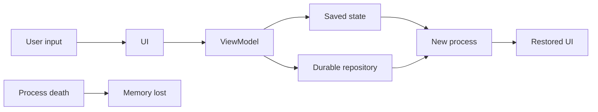

# Android Process Death, ViewModel & Saved State

## Neden önemli?
Android state yönetiminde configuration change ile process death aynı failure değildir. Rotation gibi configuration change `Activity` recreation yaratabilir ve `ViewModel` bu recreation boyunca UI-related state'i taşıyabilir. Process sistem tarafından öldürüldüğünde ise bütün in-memory graph gider. Bu nedenle state'in ömrünü ve source-of-truth'unu açıkça seçmek gerekir.

## Mental model
- **ViewModel:** oturumdaki beyaz tahta; configuration recreation'a dayanabilir.
- **SavedStateHandle / rememberSaveable:** küçük recovery checkpoint'i; process recreation'da ekranın nereden devam edeceğini söyler.
- **Database/file/network-backed repository:** durable business source of truth.

## İçeride ne oluyor?
1. Configuration change eski Activity instance'ını yok edip yenisini oluşturabilir.
2. ViewModelStore, ViewModel'i yeni Activity/Fragment instance'ına bağlayabilir.
3. Process death static/singleton/ViewModel dahil in-memory state'i yok eder.
4. Saved state küçük ve yeniden oluşturmayı yönlendiren değerler için uygundur: navigation arg, filter/query, draft pointer, scroll state.
5. Büyük object graph, bitmap veya authoritative business record saved state'e doldurulmamalıdır.
6. Restore sırasında durable source yeniden okunur; derivable UI state mümkün olduğunca source-of-truth'tan türetilir.

## Mülakat soruları
1. Configuration change ile process death arasındaki fark nedir?
2. ViewModel hangi problemi çözer, hangisini çözmez?
3. SavedStateHandle ile Room/database kullanım sınırı nedir?
4. Offline form draft'ını rotation, process death ve app relaunch karşısında nasıl tasarlarsın?
5. Restore sırasında stale server data ile local UI state çakışırsa source of truth nasıl seçilir?
6. Staff: multi-module mobil uygulamada state ownership ve restoration test standardını nasıl kurarsın?

## Beklenen cevap derinliği
- **Junior:** Activity recreation, ViewModel, temel state ayrımı.
- **Mid:** SavedStateHandle/rememberSaveable, durable storage, restore akışı.
- **Senior:** state ownership, offline draft, conflict/staleness ve testability.
- **Staff:** navigation/state contracts, module sınırları, observability ve recovery UX.

## Mini alıştırma
Checkout ekranındaki `selectedAddressId`, `couponText`, `cartItems`, `paymentToken`, `scrollPosition` alanlarını ViewModel, saved state veya durable store arasında sınıflandır. Her seçim için process-death ve security gerekçesi yaz.

## Proje fikri
`process-death-lab`: Compose ile üç ekranlı mini form; ViewModel + SavedStateHandle + Room. Background process destruction senaryosunda restore edilen/edilmeyen alanları instrumentation test ile doğrula.

## Failure modes / trade-off / production
ViewModel'i persistence sanmak veri kaybına yol açar. Her şeyi saved state'e koymak serialization/size maliyeti ve hassas veri riski üretir. Her keystroke'u durable DB'ye yazmak I/O ve complexity artırabilir. Restore success, lost-draft complaint, cold-start latency ve state-deserialization error'ları izlenmelidir.

## Kaynaklar
- Android Developers — Configuration changes: https://developer.android.com/guide/topics/resources/runtime-changes
- Android Developers — ViewModel saved state: https://developer.android.com/topic/libraries/architecture/viewmodel/viewmodel-savedstate
- Android Developers — Processes and threads: https://developer.android.com/guide/components/processes-and-threads
