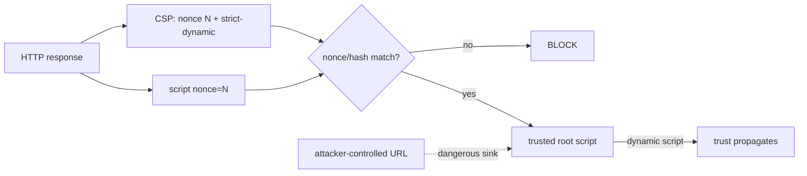

# Content Security Policy: Nonces, Hashes & `strict-dynamic`

## Neden önemli?
CSP, XSS'in kök nedenini düzeltmez; başarılı injection'ın executable JavaScript'e dönüşmesini zorlaştıran browser-enforced defense-in-depth katmanıdır. Modern strict CSP yaklaşımı geniş host allowlist'leri yerine nonce/hash tabanlı trust kurar.

## Mental model

## Temel mekanizma
- Nonce her response için yeni ve tahmin edilemez olmalı; header ile izin verilen `<script>` üzerinde eşleşir.
- Hash statik script içeriğine trust bağlar; içerik değişince hash de değişir.
- `strict-dynamic`, nonce/hash ile trusted root script'in programatik yüklediği non-parser-inserted script'lere trust aktarabilir.
- Bu aktarım trusted loader'ın attacker-controlled URL kullanmasını güvenli hale getirmez; sink/taint analizi hâlâ gerekir.
- `Content-Security-Policy-Report-Only` rollout öncesi violation gözlemi sağlar; enforcement değildir.

## Mülakat soruları
1. CSP XSS'i tamamen çözer mi?
2. Nonce ile hash ne zaman tercih edilir?
3. Nonce neden response başına değişmelidir?
4. `strict-dynamic` hangi problemi çözer, hangi trust riskini yaratır?
5. Senior: SSR + CDN/cache ile per-response nonce trade-off'u nedir?
6. Staff: report-only'den enforcement'a rollout nasıl yapılır?
7. Principal: microfrontend ve third-party tag ekosisteminde exception governance nasıl kurulur?

## Seviye beklentisi
- **Mid:** directive, nonce/hash ve defense-in-depth rolü.
- **Senior:** SSR/cache, report-only, third-party scripts ve XSS sink ilişkisi.
- **Staff:** framework entegrasyonu, violation telemetry ve supply-chain trust boundaries.
- **Principal:** organization baseline, exception governance ve product breakage risk dengesi.

## Alıştırma
SSR sayfasında first-party bundle + analytics loader için `unsafe-inline` kullanmadan nonce CSP tasarla. Analytics loader child script yüklediğinde `strict-dynamic` etkisini; loader URL'si user input'tan üretilebiliyorsa kalan riski açıkla.

## Proje
`strict-csp-lab`: permissive policy → report-only nonce CSP → enforcing strict CSP aşamalarını kur. Inline handler, `eval`, third-party loader ve attacker-controlled dynamic URL senaryolarını test et; violation report'larını release ile korele et.

## Failure modes / production
Sabit nonce, `unsafe-inline`, kontrolsüz trusted loader ve doğrudan enforcement rollout'u başlıca risklerdir. CSP violation rate, blocked directive/source, browser cohort ve release correlation izlenmeli; CSP gerçek sink remediation'ın yerine kullanılmamalıdır.

## Kaynaklar
- W3C CSP Level 3: https://www.w3.org/TR/CSP/
- MDN CSP guide: https://developer.mozilla.org/en-US/docs/Web/HTTP/Guides/CSP
- MDN practical CSP guide: https://developer.mozilla.org/en-US/docs/Web/Security/Practical_implementation_guides/CSP
