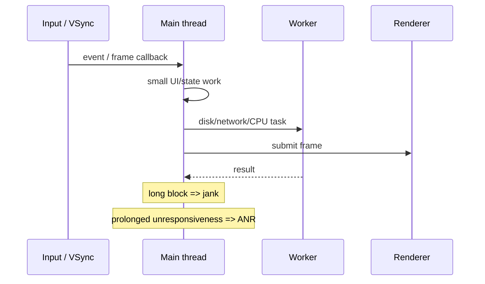

# Main Thread, Frame Budget, Jank & Android ANR Diagnosis

## Neden önemli?
Interactive UI'da ana thread input, lifecycle callbacks, layout/draw ve framework callback'lerinin önemli bölümünü seri yürütür. Blocking I/O, uzun CPU işi, lock contention veya pahalı render önce late/dropped frame yani **jank**, blokaj yeterince uzarsa Android'de **ANR (Application Not Responding)** üretebilir.

## Mental model
Doğru model "her işi background'a at" değildir. UI state mutation doğru thread'de kalmalı; pahalı iş worker'a taşınmalı; lifecycle/cancellation ve stale-result yarışları yönetilmeli; sonuç ana thread'e kontrollü dönmelidir. Ayrıca thread runnable olduğu halde CPU alamıyorsa sorun yalnız app code'u olmayabilir: scheduler/system load da incelenmelidir.

## Jank ve ANR aynı şey değildir
Jank frame deadline'ın kaçırılmasıdır; kullanıcı takılma görür. ANR ise Android'in belirli responsiveness timeout'larının aşılmasıyla ilgilidir. Kısa ama sık pahalı frame'ler ciddi jank yaratıp ANR üretmeyebilir; uzun synchronous Binder/database/network/lock beklemeleri ANR'ye gidebilir.

## Yaygın root causes
- Main thread'de blocking disk/network/database işi.
- Uzun CPU-bound parse, image transform veya layout/draw.
- Lock contention, deadlock veya priority inversion.
- Synchronous Binder call zinciri.
- Worker sonucunun lifecycle bittikten sonra UI'a uygulanması.
- CPU starvation: main thread runnable fakat scheduler yeterince CPU vermiyor.

Thread dump yalnız tek snapshot'tır ve geç alınmışsa root cause geçtikten sonra `nativePollOnce`/idle gösterebilir. Timeline trace, thread'in running/runnable/sleeping durumunu, scheduling delay, Binder ve lock ilişkilerini ayırmada daha güçlüdür. Perfetto bu nedenle production/performance triage mental modelinin önemli parçasıdır.

## Mülakat soruları
1. UI/main thread neden vardır?
2. Jank ile ANR farkı nedir?
3. Main thread'de hangi işler yapılmamalıdır?
4. Background result UI'a güvenli nasıl döner?
5. Mid: lock contention UI freeze'e nasıl dönüşür?
6. Senior: main thread runnable görünüyorsa hangi hipotezleri kurarsın?
7. Staff: Perfetto ile app bug'ı ve scheduler/system sorunu nasıl ayrılır?
8. Principal: ANR/jank metriklerini release gating'e nasıl bağlarsın?

## Beklenen cevap derinliği
**Junior:** main thread, blocking I/O, responsiveness. **Mid:** lifecycle, cancellation, worker/UI handoff, jank vs ANR. **Senior:** Binder, locks, scheduler states, traces ve root-cause attribution. **Staff/Principal:** device/OS segmentation, release gates, observability budget ve UX/business impact.

## Mini alıştırma
Ekran açılışında main thread üzerinde 40 ms JSON parse, synchronous DB read ve 25 ms image transform olduğunu varsay. Hangi işleri worker'a taşıyacağını, hangi state'in main thread'de kalacağını ve cancellation/stale-result riskini nasıl yöneteceğini çiz.

## Proje fikri
`ui-stall-lab`: kontrollü blocking I/O, lock contention ve CPU-heavy frame senaryoları üret. Perfetto trace + ANR/jank sinyalleriyle failure mode'ları ayır; sonra işi worker'a taşıyıp before/after ölç.

## Failure modes / trade-off / production
Her şeyi background thread'e taşımak; UI object'lerine worker'dan dokunmak; yalnız stack dump'a güvenmek; emulator sonucunu tüm cihaz filosuna genellemek; aggregate ANR oranının düşük seviye cihaz segmentlerini gizlemesine izin vermek tipik hatalardır. Daha fazla thread de otomatik çözüm değildir: contention, context switching ve priority inversion büyüyebilir. Production'da frame timing/jank, ANR cluster, startup, device/OS segmenti ve representative trace'ler birlikte izlenmelidir.

## Kaynaklar
- Android Developers — Diagnose and fix ANRs: https://developer.android.com/topic/performance/anrs/diagnose-and-fix-anrs
- Android Developers — Slow rendering / jank: https://developer.android.com/topic/performance/vitals/render
- Android Developers — Processes and threads: https://developer.android.com/guide/components/processes-and-threads
- Perfetto documentation: https://perfetto.dev/docs/
