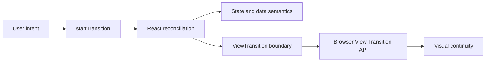

# React 19.3 View Transitions, UI State & Rendering Boundaries

React 19.3 ile `<ViewTransition>` stable oldu. Mental model: **state/data semantics → React scheduling/reconciliation → browser visual transition**. Bu katmanları birbirine karıştırmamak mülakatta temel ayrımdır.

## Ne çözer, ne çözmez?
View Transition mount/unmount, move ve resize gibi UI değişimlerini görsel olarak bağlayabilir. State persistence, cache consistency veya data fetching protokolü değildir. Transition interruption, loading boundaries, stable identity/key, accessibility ve reduced-motion ayrıca tasarlanmalıdır.

## Mülakat derinliği
Junior render/state/CSS ayrımını; Mid lifecycle'ı; Senior async navigation, interruption ve profiling'i; Staff design-system policy ve performance budget'ı; Principal/CTO UX kazanımı ile complexity/browser-support maliyetini tartışmalıdır.

## Failure modes / production
Her update'i transition yapmak, unstable identity, layout thrash, reduced-motion'u yok saymak ve fallback test etmemek yaygın hatalardır. INP, long tasks, navigation latency, dropped-frame proxy'leri ve transition-abort sinyalleri izlenebilir.

## Alıştırma ve proje
Liste→detay shared-card geçişi için state owner, loading boundary ve reduced-motion fallback'i çiz. Ardından küçük bir gallery uygulamasında transition açık/kapalı interaction latency ve navigation completion ölç.

## Kaynaklar
- https://react.dev/blog/2026/09/09/react-19-3
- https://react.dev/reference/react/ViewTransition
- https://developer.mozilla.org/en-US/docs/Web/API/View_Transition_API
