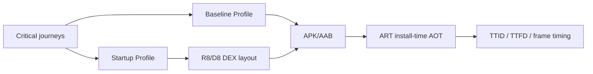

# Android Baseline Profiles, ART AOT/JIT & Startup Performance

## Konu anlatımı
Android startup performansı yalnız UI/rendering işi değildir; ART'ın uygulama kodunu interpretation, JIT ve AOT arasında nasıl çalıştırdığı da cold-start maliyetini etkiler. **Baseline Profile**, kritik user journey'lerde kullanılan class/method yollarını release ile taşıyarak ART'ın değerli hot path'leri install-time'da AOT compile etmesine yardım eder. Böylece yeni install/update sonrasında Cloud Profile öğrenmesini bekleme boşluğu azalır.

**Startup Profile** farklı bir katmandır: R8/D8 build-time'da startup için kritik kodun DEX yerleşimini iyileştirmek için profile bilgisini kullanır. Baseline Profile on-device compilation kararını, Startup Profile ise build-time code layout'u etkiler.

## İçeride ne oluyor?
1. Profile generator representative journey'leri çalıştırarak rules üretir.
2. Profile release artifact ile paketlenir ve install/update yoluyla cihaza ulaşır.
3. ART profile'daki code path'leri AOT compile ederek ilk kullanımda interpretation/JIT maliyetini azaltabilir.
4. Cloud Profiles gerçek kullanıcı davranışından zamanla oluşurken Baseline Profile release'in ilk kullanıcılarına erken optimizasyon sağlar.
5. Startup Profile DEX layout'u etkiler; iki profile türünün amacı ve pipeline aşaması farklıdır.
6. Macrobenchmark release-like koşullarda profilesız/profilli senaryoları karşılaştırmak için kullanılabilir.
7. TTID ilk frame'i, TTFD gerçek kullanılabilirliği ölçer; yalnız TTID'yi düşürmek işi ilk interaction'a erteleyebilir.

## Mülakat soruları
- JIT ve AOT trade-off'u nedir?
- Baseline Profile neden first-run/update sonrası değerlidir?
- Baseline Profile ile Startup Profile farkı nedir?
- Debug build neden startup benchmark için yanıltıcı olabilir?
- **Senior:** TTID düşerken TTFD artıyorsa ne olmuş olabilir?
- **Staff:** multi-module app için profile generation, CI gate ve production telemetry nasıl tasarlanır?

## Beklenen cevap seviyesi
- **Junior:** interpretation/JIT/AOT ayrımını bilir.
- **Mid:** Baseline/Startup Profile ve benchmark rollerini ayırır.
- **Senior:** TTID/TTFD, profile staleness ve code-layout trade-off'larını tartışır.
- **Staff:** profile lifecycle'ını release pipeline, device matrix ve regression budget ile sistemleştirir.

## Mini alıştırma
E-commerce uygulaması için cold launch→home, search→result ve product→cart journey'lerini seç. Her journey için TTID, TTFD veya frame metric'lerinden hangisini izleyeceğini ve profilesız/profilli ölçümde hangi confounder'ları kontrol edeceğini yaz.

## Proje fikri
`android-startup-lab`: Compose uygulamasında Baseline Profile generator + Macrobenchmark kur. Cold-start TTID/TTFD ve scroll frame timing'i karşılaştır; Startup Profile'ı ayrı deney olarak ekle.

## Failure modes / trade-off / production
Yanlış journey seçimi profile'ı şişirip gerçek hot path'i kaçırabilir. Emulator/debug/warm-cache ölçümleri sahte iyileşme gösterebilir. Navigation değişince profile stale kalabilir. Deferred work TTID'yi iyileştirirken TTFD/jank'i kötüleştirebilir. Production'da startup dağılımları, TTID, TTFD, jank, ANR, release ve low-end-device cohort'ları birlikte izlenmelidir.

## Kaynaklar
- Android Developers — Baseline Profiles: https://developer.android.com/topic/performance/baselineprofiles/overview
- Android Developers — Create Baseline Profiles: https://developer.android.com/topic/performance/baselineprofiles/create-baselineprofile
- Android Developers — Macrobenchmark: https://developer.android.com/topic/performance/benchmarking/macrobenchmark-overview
- Android Developers — Measure Baseline Profiles: https://developer.android.com/topic/performance/baselineprofiles/manually-create-measure
