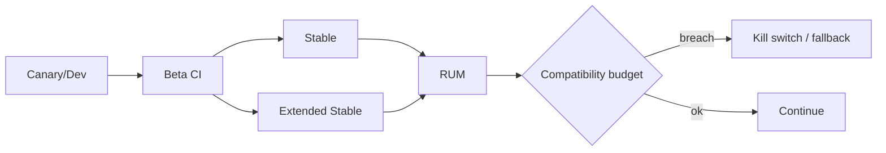

# Browser Release Cadence, Compatibility Budgets & Enterprise Rollouts

## Mental model
Browser, frontend uygulamasının ekip tarafından deploy edilmeyen external runtime dependency'sidir. Release cadence hızlandıkça doğru cevap manuel qualification hacmini artırmak değil; pre-release CI, feature detection, real-user telemetry ve containment mekanizmalarını otomatikleştirmektir.

## Güncel bağlam
Google, Chrome 153'ün 8 Eylül 2026'da Stable'a çıkışıyla Stable release cadence'ini dört haftadan iki haftaya indirdi. Enterprise Extended Stable major feature update'lerini sekiz haftada bir alırken security fixes daha sık backport edilir. Daha küçük ve sık change batch regression isolation ve patch latency'yi iyileştirebilir; buna karşılık qualification sıklığını artırır.

## Compatibility budget
Bir compatibility SLO yalnız 'sayfa açılıyor' olmamalıdır. Kritik journey success rate, JS exception rate, browser/version bazlı Core Web Vitals, API fallback rate ve mitigation time gibi sinyaller kullan. Beta'da bulunan regression Stable'a gelmeden gate'i durdurmalı; Stable'daki regression feature flag/kill switch ile hızlı containment sağlamalıdır.

## Seviye beklentisi
Junior/Mid: feature detection, progressive enhancement ve cross-browser test. Senior: Beta CI, RUM, kill switch ve regression isolation. Staff: channel/fleet segmentation, extensions/WebViews ve compatibility SLO. EM/CTO: patch latency, security exposure, compliance, qualification cost ve business continuity.

## Production failure modes
UA sniffing'e aşırı güvenmek, yalnız developer browser'ında test etmek, Beta'yı gözlemleyip release gate'e bağlamamak, browser-version dimension tutmamak ve enterprise WebView/extension fleet'ini unutmak.

## Kaynaklar
- https://developer.chrome.com/blog/chrome-two-week-start
- https://developer.chrome.com/blog/new-in-chrome-153
- https://developer.chrome.com/blog/chrome-155-beta
- https://developer.mozilla.org/en-US/docs/Learn_web_development/Extensions/Testing/Feature_detection
