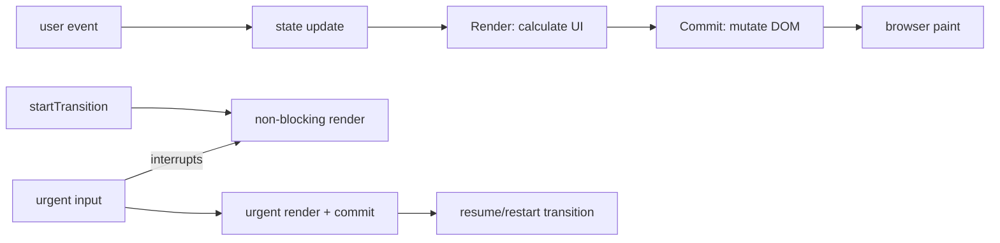

# React Render/Commit, Transitions & Responsiveness

**Seviye:** Junior → Staff

## Konu anlatımı
React'te render ile DOM mutation aynı şey değildir. State update render work'ünü tetikler; React component tree'den UI sonucunu hesaplar, commit aşamasında gereken DOM değişikliklerini uygular. Render saf ve tekrar çalıştırılabilir olmalı; dış dünya side effect'leri render içine taşınmamalıdır.

Transition bazı state update'lerini urgent olmayan iş olarak işaretleyerek kullanıcı etkileşimini bloklamadan background render yapılmasını sağlar. Transition work daha acil update tarafından interrupt edilip yeniden başlatılabilir. Bu scheduling özelliği debounce veya network cancellation ile aynı kavram değildir.

## İçeride ne oluyor?
- Render component fonksiyonlarını çalıştırıp UI sonucunu hesaplar; commit gerçek DOM değişikliklerini uygular.
- Re-render DOM mutation gerektirmeyebilir.
- `useTransition` `isPending` ve `startTransition` sağlar; transition state update'leri non-blocking'dir.
- Transition work urgent input tarafından interrupt edilip yeniden render edilebilir.
- Controlled text input update'i transition içine konmamalıdır; input state senkron kalmalıdır.
- Async Action/request sonuçlarında ordering problemi olabilir; stale response guard, abort/queue veya framework abstraction gerekebilir.
- React 19.3, 9 Eylül 2026'da yayımlandı; `<ViewTransition>` bu sürümde stable oldu. View transition görsel animasyon katmanıdır; scheduling transition ile aynı şey değildir.

## Yüksek getirili mülakat soruları
1. Render ile commit farkı nedir?
2. Re-render neden mutlaka DOM update değildir?
3. Render purity neden önemlidir?
4. `useTransition` neyi çözer; debounce ile aynı mıdır?
5. Controlled input state neden transition olmamalıdır?
6. Senior: pahalı chart/filter update'inde urgent ve non-urgent state'i nasıl ayırırsın?
7. Staff: async transition sonuçlarının out-of-order gelmesini nasıl yönetirsin?

## Seviyeye göre cevap derinliği
- **Junior:** state update → render → commit → paint.
- **Mid:** purity, effects, transition ve pending UI.
- **Senior:** interruption, stale async result, Suspense ve profiling.
- **Staff:** interaction latency budget, scheduling boundaries, router/framework integration ve UX trade-off'ları.

## Kısa alıştırma
10.000 satırlık filtrelenebilir listede input değerini synchronous state'te tut; ağır filtre sonucunu transition ile güncelle. Hızlı yazarken eski async/render sonucunun yeni sonucu ezmesini önleyecek version veya abort stratejisi tasarla.

## Proje fikri
`react-responsiveness-lab`: büyük dataset + arama + chart içeren sayfa yap. Normal update ve transition sürümünü React Profiler/browser performance timeline ile karşılaştır; interaction latency, commit duration ve dropped-frame davranışını ölç.

## Failure modes / trade-off / production bağlantısı
Her update'i transition yapmak, transition'ı network cancellation sanmak, render içine analytics/network side effect koymak, stale async response'u state'e yazmak ve pending feedback vermemek tipik hatalardır. Production'da INP/interaction latency, long tasks, render/commit duration, error rate ve action ordering correctness birlikte değerlendirilir.

## Kaynaklar
- React — Render and Commit: https://react.dev/learn/render-and-commit
- React — useTransition: https://react.dev/reference/react/useTransition
- React — startTransition: https://react.dev/reference/react/startTransition
- React 19.3 release — 9 Sep 2026: https://react.dev/blog/2026/09/09/react-19-3
