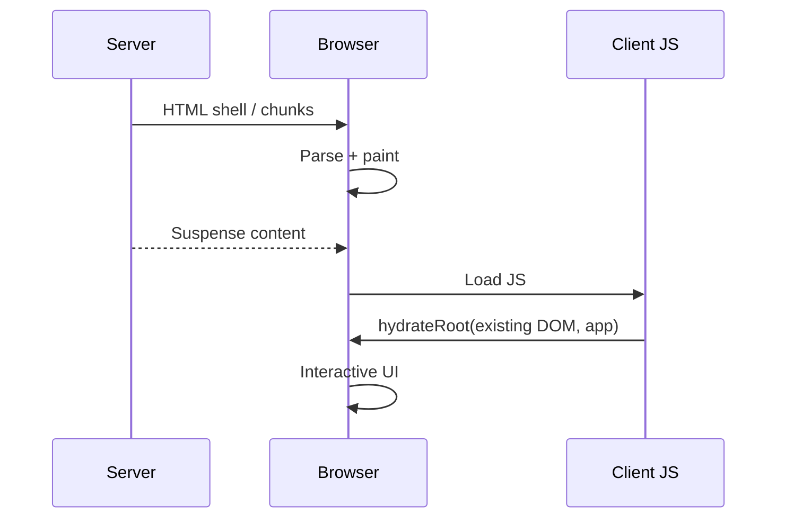

# SSR, Hydration, Streaming & Hydration Mismatches

## Konu anlatımı
SSR server'da HTML snapshot üretir; hydration client React tree'sini mevcut HTML'ye bağlayarak state ve event davranışını devralır. Görünür HTML interaktif UI ile aynı şey değildir. React `hydrateRoot` server ve client ilk çıktısının eşleşmesini bekler; mismatch correctness problemi olarak ele alınmalıdır.

Streaming SSR tek HTML string'ini beklemek yerine shell ve hazır Suspense bölgelerini zaman içinde gönderebilir. Böylece server compute/data wait ile network/browser parsing overlap olabilir; fakat JS execution, hydration ve data consistency otomatik çözülmez.

## Mental model
SSR bir fotoğraf, hydration fotoğrafa kontrolleri bağlamaktır. Server fotoğrafı ile client'ın beklediği sahne farklıysa davranışı güvenle bağlamak zorlaşır. Streaming fotoğrafın hazır parçalarını erkenden göndermektir.

## İçeride ne oluyor?
- Server HTML üretir; browser JS tamamlanmadan parse/paint edebilir.
- `hydrateRoot` mevcut DOM'a React davranışını bağlar.
- `Date.now()`, random, locale/timezone, browser-only branch ve farklı data snapshot'ı mismatch yaratabilir.
- `renderToString` streaming sağlamaz; streaming server APIs shell/content'i aşamalı gönderir.
- Suspense boundary yavaş data'nın tüm document'i bloklamasını azaltabilir.
- Two-pass client rendering deterministic first render sağlar fakat ekstra render/UX maliyeti vardır.

## Mülakat soruları
1. SSR ve hydration farkı nedir?
2. Görünür buton neden henüz çalışmayabilir?
3. Dört hydration mismatch sebebi say.
4. `renderToString` ile streaming farkı nedir?
5. Streaming hangi latency'yi çözmez?
6. Server/client data snapshot tutarlılığı nasıl sağlanır?
7. Staff: server/client rendering boundary ve performance budget nasıl seçilir?

## Beklenen cevap seviyesi
- **Junior:** HTML üretimi vs interaktivite.
- **Mid:** deterministic first render, mismatch, browser-only APIs, streaming.
- **Senior:** Suspense, cache/data consistency, error recovery, JS execution metrics.
- **Staff:** rendering architecture, CDN/cache, failure isolation ve performance budgets.

## Mini alıştırma
Server UTC, client local timezone ile timestamp render ediyor. Mismatch'i açıkla; serialized snapshot, deterministic UTC+effect ve client-only çözümlerini karşılaştır.

## Proje fikri
`hydration-lab`: CSR, string SSR ve streaming SSR sürümlerini 800 ms data delay ile karşılaştır. TTFB, visible content, JS bytes, long tasks ve interaction zamanını ölç; kasıtlı mismatch'i production logging ile yakala.

## Failure modes / trade-off / production bağlantısı
SSR server compute/cache maliyeti ekler. Proxy/CDN buffering streaming faydasını azaltabilir. Büyük JS bundle interaktiviteyi geciktirir. `suppressHydrationWarning`'ı genel çözüm yapmak gerçek correctness hatalarını gizleyebilir. Route bazlı TTFB, LCP, INP/long tasks, hydration errors ve cache hit oranı birlikte değerlendirilmelidir.

## Kaynaklar
- React — `hydrateRoot`: https://react.dev/reference/react-dom/client/hydrateRoot
- React — `renderToPipeableStream`: https://react.dev/reference/react-dom/server/renderToPipeableStream
- React — `renderToReadableStream`: https://react.dev/reference/react-dom/server/renderToReadableStream
- React — `renderToString`: https://react.dev/reference/react-dom/server/renderToString
