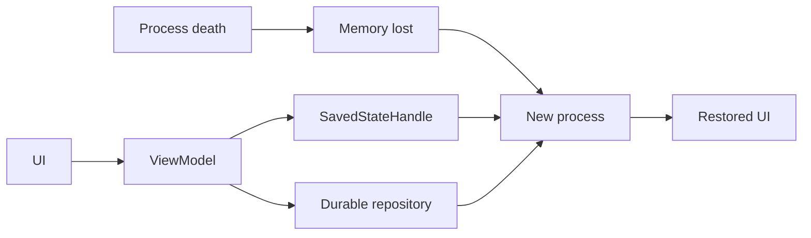

# Android Process Death, ViewModel & Saved State

## Neden önemli?
Android UI state sorularında en kritik ayrım configuration recreation ile process death arasındadır. Rotation gibi configuration change `Activity` instance'ını yeniden yaratabilir. ViewModel configuration change boyunca state taşımak için uygundur; ancak OS process'i öldürdüğünde bütün in-memory state kaybolur. Recovery için küçük UI checkpoint'leri saved state'te, authoritative business data ise durable repository'de tutulmalıdır.

## State lifetime mental modeli
- Widget-local state: kısa ömürlü; gerekiyorsa `rememberSaveable`.
- Screen UI state: ViewModel tarafından yönetilebilir.
- Process-death recovery checkpoint: küçük, serializable state için `SavedStateHandle`.
- Durable domain state: Room/file/server/repository source of truth.

ViewModel'i beyaz tahta, saved state'i küçük checkpoint kartı, repository'yi kayıt sistemi olarak düşün.

## Configuration change vs process death
Configuration change'de eski Activity yok edilir ve yenisi oluşturulur. ViewModelStore uygun scope'ta ViewModel'i yeni instance'a bağlayabilir. Process death'te ise ViewModel, singleton ve heap'teki tüm object graph kaybolur. Uygulama geri geldiğinde yeni process kurulur; saved state ve durable source'lardan ekran yeniden oluşturulur.

## Ne saved state'e konur?
Navigation destination/ID, küçük query/filter, kullanıcı draft'ının küçük parçası veya durable kayda pointer iyi adaylardır. Büyük bitmap/object graph, cache'in tamamı, authoritative record veya hassas token'lar kötü adaylardır. Saved state bir database replacement değildir.

## Restore tasarımı
1. Yeni process/application graph'ı oluştur.
2. Navigation ve küçük UI checkpoint'lerini saved state'ten al.
3. Authoritative data'yı repository'den yükle.
4. Derived UI state'i yeniden hesapla.
5. Saved checkpoint ile durable data çakışıyorsa açık conflict/staleness policy uygula.

## Mülakat soruları
1. Configuration change ile process death farkı nedir?
2. ViewModel hangi state'i korur; hangi durumda kaybolur?
3. `SavedStateHandle` ile Room/database sınırı nedir?
4. Neden büyük object graph saved state'e konmamalıdır?
5. Offline form draft'ını rotation, process death ve relaunch için nasıl tasarlarsın?
6. Restore edilen local UI state server state ile çakışırsa ne yaparsın?
7. Staff seviyesinde state ownership/restoration standardını nasıl kurarsın?

## Seviyeye göre cevap derinliği
- Junior: lifecycle/recreation ve ViewModel amacı.
- Mid: saved state vs durable persistence.
- Senior: source of truth, offline draft, staleness/conflict ve testability.
- Staff: multi-module state contracts, navigation, observability, recovery UX ve güvenlik.

## Mini alıştırma
Checkout ekranındaki `selectedAddressId`, `couponText`, `cartItems`, `paymentToken`, `scrollPosition` alanlarını ViewModel, saved state ve durable store arasında sınıflandır; process-death ve security gerekçesi ekle.

## Proje fikri
Compose ile üç ekranlı form kur. ViewModel + SavedStateHandle + Room kullan. Background process destruction sonrasında ekranın doğru state'e dönmesini instrumentation test ile doğrula.

## Failure modes / trade-off / production
ViewModel'i persistence sanmak veri kaybına yol açar. Saved state'i şişirmek serialization/size maliyeti ve privacy riski yaratır. Her değişikliği synchronous durable write yapmak latency/complexity artırır. Restore success, lost-draft şikayeti, cold-start latency, crash/ANR ve deserialization error metriklerini izle.

## Kaynaklar
- Android Developers — Configuration changes: https://developer.android.com/guide/topics/resources/runtime-changes
- Android Developers — ViewModel saved state: https://developer.android.com/topic/libraries/architecture/viewmodel/viewmodel-savedstate
- Android Developers — Processes and threads: https://developer.android.com/guide/components/processes-and-threads
