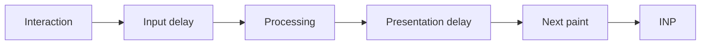

# Interaction to Next Paint, Long Tasks & RUM Diagnosis

## Neden önemli?
INP, kullanıcı etkileşiminin görünür bir sonraki paint'e ulaşmasına kadar responsiveness'i değerlendirir. 12 Mart 2024'ten beri Core Web Vital'dır ve FID'nin yerini almıştır. web.dev iyi deneyim için page-load p75'te INP ≤200 ms hedefini kullanır.

## Mental model

Responsiveness bir **main-thread budget** problemidir. Önceki long task input delay yaratabilir; synchronous handler processing'i, render/layout/paint ise presentation delay'i büyütebilir.

## Event Timing ve RUM
W3C Event Timing API'nin 19 Mart 2026 Working Draft'ı `PerformanceEventTiming`, `processingStart`, `processingEnd`, `targetSelector` ve ilişkili event'leri gruplayan `interactionId` tanımlar. Production RUM'da route/component/interaction türü gibi kontrollü boyutlarla attribution yapılabilir. Kullanıcı girdisi ve hassas DOM içeriği telemetry'ye taşınmamalıdır.

## İyileştirme stratejileri
- Long synchronous işi küçük parçalara böl ve gerektiğinde main thread'e yield et.
- CPU-heavy ve DOM gerektirmeyen işi uygun olduğunda Worker'a taşı.
- Render scope'unu küçült; gereksiz state propagation/re-render'ı azalt.
- Lab trace ile nedeni bul, field/RUM percentile ile gerçek kullanıcı etkisini doğrula.
- Mobile/desktop ve device class'ı ayrı değerlendir.

## Mülakat soruları
1. INP ile FID farkı nedir?
2. Long task handler dışında INP'yi nasıl bozar?
3. `setTimeout(0)` neden sihirli çözüm değildir?
4. Chunking ve Worker arasında nasıl seçim yaparsın?
5. Lab ve field sonuçları neden ayrışır?
6. RUM attribution hangi privacy/cardinality risklerini getirir?
7. Senior: bir INP regression'ını nasıl debug edersin?
8. Staff: performance budget/release gate nasıl kurulur?

## Seviyeye göre cevap
- **Junior:** main thread, handler, render ve long-task ilişkisi.
- **Mid:** input/processing/presentation breakdown, chunking ve worker trade-off.
- **Senior:** Event Timing/RUM, percentile, device segmentation ve attribution.
- **Staff:** org-wide budget, privacy-safe telemetry, lab+field gates ve ownership.

## Mini alıştırma
Autocomplete'te 80 ms transform + 90 ms render + 60 ms presentation var. Worker/chunk/render optimizasyon planı ve RUM alanlarını tasarla.

## Proje fikri
`inp-lab`: CPU-heavy handler, render-heavy component ve background long-task senaryoları içeren SPA; Event Timing RUM ile p75/p95 breakdown dashboard.

## Failure modes / trade-off / production
Sadece Lighthouse/average kullanmak, desktop'ı mobile'a genellemek, yüksek-cardinality selector toplamak, Worker serialization maliyetini yok saymak ve UI update'ini aşırı parçalamak tipik hatalardır. p75/p95 INP, long-task duration, route/component attribution, device class, JS errors ve release version birlikte izlenmelidir.

## Kaynaklar
- web.dev — INP Core Web Vital launch: https://web.dev/blog/inp-cwv-launch
- web.dev — Optimize INP (updated 2 Sep 2025): https://web.dev/articles/optimize-inp
- W3C Event Timing API Working Draft (19 Mar 2026): https://www.w3.org/TR/event-timing/
- W3C publication history: https://www.w3.org/standards/history/event-timing/
