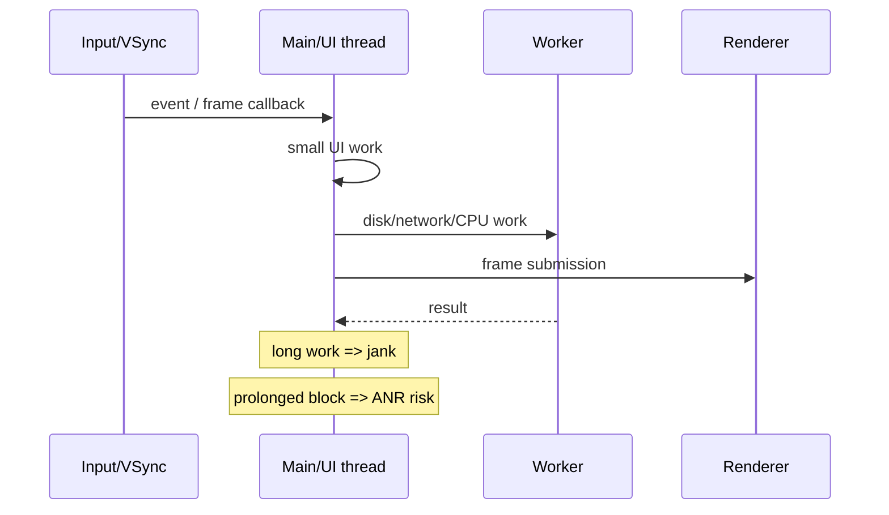

# Main Thread, Frame Budget, Jank & Android ANR Diagnosis

## Konu anlatımı
Interactive UI sistemlerinde main/UI thread input, lifecycle callbacks, state/UI mutations ve render pipeline'ın önemli bölümlerini seri yürütür. Main thread'deki blocking I/O, uzun CPU işi, lock contention veya pahalı frame işi önce responsiveness'i ve frame timing'i bozar; Android'de yeterince uzun blokaj belirli timeout sınıflarında ANR'a dönüşebilir.



## Jank ve ANR aynı şey değildir
Jank, frame'in beklenen presentation deadline'ını kaçırmasıyla görünür akıcılık bozulmasıdır. ANR ise Android'in belirli responsiveness timeout koşullarını aşan uygulama davranışıdır. Bir uygulama ciddi jank yaşayabilir fakat ANR üretmeyebilir; uzun main-thread block ise ikisini birden tetikleyebilir.

## Yaygın nedenler
- main thread'de network/database/blocking I/O
- uzun synchronous Binder calls
- lock contention / priority inversion
- pahalı layout/draw veya CPU-heavy callback
- startup critical path'te fazla iş
- yanlış thread'den UI hierarchy erişimi

"Her işi background'a at" doğru model değildir. UI mutation doğru thread'de kalmalı; worker işi lifecycle/cancellation ile yönetilmeli; sonuç geri dönerken ekran/state artık geçersiz olabilir.

## Trace mental modeli
Thread dump yalnız tek anı gösterir ve geç alınırsa gerçek stall kaybolabilir. Timeline trace şu ayrımı yapar:

```text
main thread state
RUNNING   -> CPU üzerinde çalışıyor
RUNNABLE  -> çalışabilir ama CPU/scheduler bekliyor
BLOCKED   -> lock / sync primitive bekliyor
SLEEP/IO  -> event veya I/O bekliyor
```

Perfetto ile main thread'in running/runnable state'i, Binder calls, lock contention ve system load birlikte incelenebilir. Android'in resmi ANR rehberi de app sorunu ile system scheduling sorununu ayırmak için trace kullanımını önerir.

## Mülakat soruları
1. Main/UI thread neden vardır?
2. Jank ile ANR farkı nedir?
3. Main thread'de hangi işler yapılmamalıdır?
4. Worker sonucu UI'a güvenli nasıl döner?
5. Lock contention UI freeze'e nasıl dönüşür?
6. Main thread runnable ise hangi hipotezleri kurarsın?
7. Perfetto ile app bug ve system scheduling problemi nasıl ayrılır?
8. ANR/jank metriklerini release gating'e nasıl bağlarsın?

## Seviyeye göre cevap
- **Junior:** main thread, blocking I/O, responsiveness.
- **Mid:** lifecycle, cancellation, worker/UI handoff, jank vs ANR.
- **Senior:** Binder, locks, scheduler states, traces, root-cause attribution.
- **Staff/Principal:** fleet/device segmentation, release gates, observability ve UX/business impact.

## Mini alıştırma
Ekran açılışında main thread'de 40 ms JSON parse, synchronous DB read ve 25 ms image transform olduğunu varsay. Hangi işleri worker'a taşıyacağını, hangi UI state'in main thread'de kalacağını ve stale-result/cancellation riskini nasıl yöneteceğini çiz.

## Proje fikri
`ui-stall-lab`: kontrollü blocking I/O, lock contention ve CPU-heavy frame senaryoları olan küçük Android uygulaması kur. Perfetto trace ve ANR/jank sinyallerini kaydet; her failure mode için before/after düzeltme raporu üret.

## Failure modes / production bağlantısı
Her şeyi background thread'e taşımak; worker'dan UI object'lerine dokunmak; tek stack dump'a güvenmek; emulator sonucunu tüm cihaz filosuna genellemek; aggregate ANR oranının cihaz/OS segmentlerini saklamasına izin vermek tipik hatalardır. Production'da startup, frame timing/jank, ANR clusters, device/OS segmenti ve trace örnekleri birlikte değerlendirilir.

## Kaynaklar
- Android Developers — Diagnose and fix ANRs: https://developer.android.com/topic/performance/anrs/diagnose-and-fix-anrs
- Android Developers — Slow rendering / jank: https://developer.android.com/topic/performance/vitals/render
- Android Developers — Processes and threads: https://developer.android.com/guide/components/processes-and-threads
- Perfetto documentation: https://perfetto.dev/docs/
