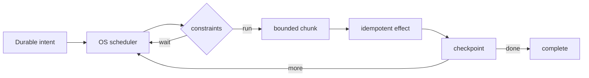

# Background Work, OS Scheduling ve Idempotent Mobile Jobs

## Neden bu konu?
Mobilde `async` çalıştırmak durable background execution garantisi değildir. Process kill, reboot, connectivity, battery policy ve OS quota nedeniyle kritik iş, platform scheduler semantics'i ve business idempotency birlikte tasarlanarak güvenilir hale gelir.

## Mental model

**Invariant:** geç, tekrar veya restart sonrasında çalışan job business effect'i bozmaz.

## Platform modeli
Android kalıcı işler için WorkManager'ı önerir; constraint'ler sağlandıktan sonra persistent work yürütülür ve unique work duplicate enqueue'yu azaltabilir. iOS BackgroundTasks kritik işi sistem tarafından planlanan background execution'a taşır. Scheduler kesin zaman garantisi değildir; exact user-visible alarm farklı bir gereksinim sınıfıdır.

## Tasarım checklist'i
1. Intent'i durable sakla.
2. Job/effect için idempotency key üret.
3. İşi bounded chunk'lara böl ve checkpoint et.
4. Network/charging gibi constraint'leri freshness SLO'ya göre seç.
5. Retry'ı bounded exponential backoff + jitter ile yap.
6. Backend effect'ini idempotent tasarla.
7. Reconnect sırasında fleet-wide burst için load shaping uygula.

## Mülakat soruları
- Coroutine ile WorkManager farkı nedir?
- Unique work neden server idempotency'nin yerini tutmaz?
- Process kill ortasında resumable upload nasıl recover edilir?
- Battery ile freshness nasıl dengelenir?
- Staff seviyesinde Android/iOS ortak SLO nasıl tanımlanır?

## Seviye beklentisi
Junior durable/non-durable ayrımını bilir. Mid constraints, retry ve checkpoint kurar. Senior partial progress, idempotency, backend burst ve telemetry tasarlar. Staff cross-platform product SLO, rollout ve capacity'yi birlikte yönetir.

## Alıştırma ve proje
500 MB resumable upload için chunk checkpoint, unique job ve idempotency endpoint tasarla. Bunu WorkManager ile çalışan küçük `durable-mobile-uploader` demosuna dönüştür.

## Failure modes / production
Duplicate enqueue, sonsuz retry, non-idempotent POST, devasa tek job, battery drain ve reconnect stampede tipik hatalardır. `enqueue→start`, retry count, completion latency, duplicate suppression, bytes retried, battery/network class ve backend arrival burst'lerini izle.

## Kaynaklar
- Android Persistent Work: https://developer.android.com/develop/background-work/background-tasks/persistent
- Android WorkManager: https://developer.android.com/reference/androidx/work/WorkManager
- Android Unique Work: https://developer.android.com/develop/background-work/background-tasks/persistent/how-to/manage-work
- Apple Background Tasks: https://developer.apple.com/documentation/backgroundtasks
