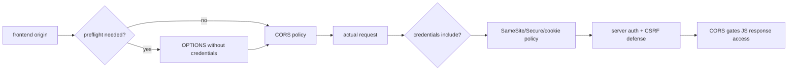

# CORS, Preflight, Credentialed Requests, SameSite & CSRF

## Neden önemli?
CORS, cookie gönderimi ve CSRF aynı problem değildir. Browser security bug'larını doğru teşhis etmek için bu üç katmanı ayırmak gerekir: CORS cross-origin response'un JavaScript'e açılmasını, cookie policy credential'ın gönderilip gönderilmesini, CSRF savunması ise state-changing isteğin meşruiyetini yönetir.

## Mental model

## Temel mekanik
- Origin scheme + host + port üçlüsüdür; SameSite'taki “site” ile birebir aynı kavram değildir.
- Non-simple cross-origin method/header kombinasyonları preflight gerektirebilir.
- Fetch standardında CORS preflight credential taşımaz; actual request `credentials: include` ile credential taşıyabilir.
- Credentialed CORS'ta `Access-Control-Allow-Origin: *` kullanılamaz; explicit origin ve `Access-Control-Allow-Credentials: true` gerekir.
- Cross-origin Fetch'in default credentials mode'u `same-origin` olduğundan cookie gereken akışta çoğunlukla `include` gerekir.
- `SameSite=None` cross-site cookie akışına izin verir ve `Secure` gerektirir. `Lax`/`Strict` daha dar gönderim politikalarıdır.
- CORS CSRF koruması değildir. SameSite defense-in-depth sağlar; state-changing endpoint'lerde CSRF token/origin validation gibi kontroller gerekebilir.

## Mülakat soruları
1. SOP ve CORS arasındaki fark nedir?
2. Preflight neden vardır?
3. Credentialed CORS'ta wildcard origin neden yasaktır?
4. `credentials: include` varken cookie neden gitmeyebilir?
5. CORS neden CSRF'yi tek başına çözmez?
6. `Origin` değerini körlemesine reflect etmek neden tehlikelidir?
7. SPA + API farklı origin'lerdeyse session güvenliğini nasıl tasarlarsın?

## Seviyeye göre cevap
- **Junior:** origin, SOP, preflight.
- **Mid:** credentials mode, ACAO/ACAC, SameSite/Secure.
- **Senior:** CSRF ayrımı, allowlist, `Vary: Origin`, third-party-cookie davranışı.
- **Staff:** BFF alternatifi, cookie scope, browser/API trust boundary ve telemetry.

## Mini alıştırma
`app.example` → `api.example` cookie tabanlı POST akışını `app.partner.test` frontend'ine taşı. Fetch, CORS, cookie ve CSRF ayarlarını ayrı ayrı yaz.

## Proje
`cors-cookie-lab`: iki local origin üzerinde simple/preflight request, credential mode, explicit/wildcard ACAO ve SameSite kombinasyonlarını otomatik test et; browser network trace'leriyle güvenli baseline çıkar.

## Failure modes / trade-off / production
- Request `Origin` değerini doğrulamadan reflect etmek allowlist'i bozar.
- Preflight failure backend 5xx değildir; client/browser katmanında ayrı gözlemlenmelidir.
- `SameSite=None` daha geniş credential yüzeyi yaratır.
- CDN/proxy CORS cevabını origin'e göre yanlış cache'lerse policy başka origin'e taşınabilir; uygun cache-key/`Vary` gerekir.
- Preflight failure, auth/session failure, CSRF rejection ve origin dağılımını birlikte izle.

## Kaynaklar
- WHATWG Fetch Standard: https://fetch.spec.whatwg.org/
- MDN CORS: https://developer.mozilla.org/en-US/docs/Web/HTTP/Guides/CORS
- MDN Set-Cookie: https://developer.mozilla.org/en-US/docs/Web/HTTP/Reference/Headers/Set-Cookie
- OWASP Session Management: https://cheatsheetseries.owasp.org/cheatsheets/Session_Management_Cheat_Sheet.html
