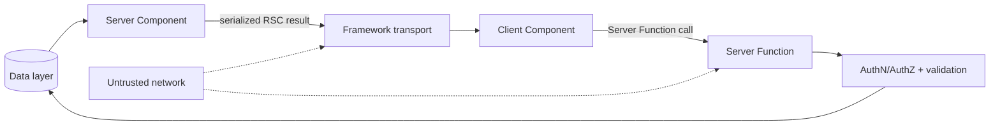

# React Server Components, Server Functions & Trust Boundaries

## Mental model

## Konu anlatımı
React Server Components (RSC), component'ların client bundle dışında server/build environment'ında çalışmasını sağlar. Server Component data layer'a erişebilir ve Client Component'a render edilebilir veri/JSX aktarabilir; implementation browser bundle'ına gönderilmez. Client Components interactivity/state/browser API'leri içindir ve `"use client"` boundary'si bundle/data-flow kararını etkiler.

Server Functions, client tarafının server'da çalışan async functions çağırmasına izin verir. Bu ergonomi güvenlik sınırını kaldırmaz: network'ten çağrılabilen her Server Function authentication, authorization, validation, rate limiting ve abuse control gerektiren endpoint gibi ele alınmalıdır.

## Internals ve trade-off
Async Server Components render sırasında data bekleyerek bazı client-effect waterfall'larını azaltabilir. Buna karşılık server round trips, serialization ve cache policy yeni latency/boundary kararları yaratır. Client'a serialize edilen her değer disclosure açısından incelenmelidir. React 19'da RSC/Server Functions stable olsa da framework/bundler implementation API'leri minor sürümler arasında semver-stable değildir; framework implementer'ları version pinning düşünmelidir.

2025 sonu ve 2026 başındaki resmi React advisories RSC/Server Function payload yollarında RCE, DoS ve source-code-exposure sınıflarını gösterdi. Ders: framework serialization/deserialization katmanı gerçek bir production attack surface'tir.

## Mülakat soruları
- **Mid:** Server Component ile SSR aynı şey midir? `use client` neyi değiştirir?
- **Senior:** RSC hangi waterfall'ı azaltabilir? Server Function neden backend endpoint'i gibi korunur?
- **Staff:** client/server boundary'yi bundle size, latency, cacheability, authorization ve secret exposure ile nasıl seçersin?
- **Principal:** framework vulnerability çıktığında asset inventory, patch SLA, exposure mapping, canary ve rollback nasıl yönetilir?

Beklenen üst seviye cevap component API'sinden çok capability boundary, transport, authorization, caching ve supply-chain riskini bağlar.

## Kısa alıştırma
Bir analytics dashboard'u Server/Client Component'lara böl. Her component için execution location, serialized data, authz point ve cache policy yaz.

## Proje
`rsc-boundary-lab`: read-heavy dashboard, küçük interactive islands ve bir Server Function oluştur. Authorization testleri, payload-size ölçümü, dependency inventory ve vulnerability gate ekle.

## Failure modes / production
Server Function'ı trusted local call sanmak authz bypass'a; aşırı client boundary bundle şişmesine; aşırı server interaction latency'ye; secrets'i serialized props'a koymak disclosure'a; framework patchlerini geciktirmek yüksek etkili exploit riskine yol açabilir. RSC payload size, server render latency, cache hit, function latency/errors, authz denials, dependency versions ve advisory exposure birlikte izlenmelidir.

## Kaynaklar
- React — Server Components: https://react.dev/reference/rsc/server-components
- React — Server Functions: https://react.dev/reference/rsc/server-functions
- React — Critical Security Vulnerability in RSC, 2025-12-03: https://react.dev/blog/2025/12/03/critical-security-vulnerability-in-react-server-components
- React — DoS and Source Code Exposure in RSC, updated 2026-01-26: https://react.dev/blog/2025/12/11/denial-of-service-and-source-code-exposure-in-react-server-components
