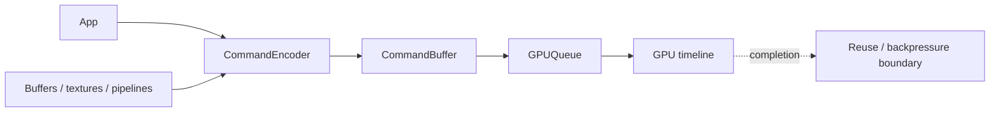

# WebGPU Command Model, Resource Lifetime & GPU Backpressure

**Seviye:** Mid → Staff  
**Alan:** Frontend / Systems

## Konu anlatımı
WebGPU modern GPU'lara browser içinden rendering ve compute işi gönderen, WebGL'den ayrı tasarlanmış bir API'dir. CPU tarafında `GPUDevice` resource ve pipeline'ları oluşturur; `GPUCommandEncoder` komutları kaydeder; `finish()` command buffer üretir; `GPUQueue.submit()` işi GPU timeline'ına yollar. JavaScript çağrısının dönmesi GPU completion anlamına gelmez. Bu asenkronluk throughput sağlar fakat frame-in-flight, resource reuse, readback ve memory budget kararlarını kritik hale getirir.

## Mental model

**Invariant:** CPU submission ve GPU completion ayrı zaman çizgileridir; kaynak yeniden kullanımını completion gerçeğine göre tasarla.

## İçeride ne oluyor?
- Adapter GPU yeteneklerini, device uygulamanın resource/command alanını temsil eder.
- Encoder render/compute/copy pass komutlarını kaydeder.
- Queue asenkron CPU→GPU submission boundary'sidir.
- Buffer/texture usage flag'leri validation ve optimization sınırı sağlar.
- Pipeline creation hot-path maliyeti yaratabileceğinden cache/reuse önemlidir.
- Readback ve fazla frame-in-flight latency/memory trade-off'u yaratır.

## Mülakat soruları
1. `queue.submit()` döndüğünde GPU işi bitmiş midir?
2. Command encoder ile command buffer neden ayrıdır?
3. Resource usage flag'leri neden önemlidir?
4. Her frame pipeline yaratmanın maliyeti nedir?
5. GPU readback neden stall yaratabilir?
6. Senior: triple buffering throughput ve input latency'yi nasıl etkiler?
7. Staff: device loss, feature negotiation ve fallback'i nasıl tasarlarsın?

## Beklenen cevap seviyesi
- **Mid:** adapter/device/queue/encoder rollerini ayırır.
- **Senior:** async GPU timeline, resource reuse, pipeline cache, readback ve frame pacing'i açıklar.
- **Staff:** device loss, telemetry, memory budget ve progressive fallback tasarlar.

## Mini alıştırma
60 FPS particle simulation için compute→render pipeline çiz. Double/triple buffering altında hangi buffer'ın ne zaman yeniden kullanılabileceğini işaretle.

## Proje fikri
`webgpu-particle-lab`: WGSL compute shader ile 100K particle update + render; pipeline cache ve buffering stratejilerini benchmark et.

## Failure modes / trade-off / production bağlantısı
Her frame resource/pipeline yaratmak, GPU completion beklemeden overwrite etmek, gereksiz CPU readback, feature/limit kontrolü yapmamak ve device-loss/fallback planı bırakmamak tipik hatalardır. Frame time, encode time, memory, pipeline creation latency ve device-loss/fallback oranı izlenir.

## Kaynaklar
- W3C WebGPU Candidate Recommendation Draft — 1 Eylül 2026: https://www.w3.org/TR/webgpu/
- W3C WebGPU publication history: https://www.w3.org/standards/history/webgpu/
- W3C WGSL Candidate Recommendation Draft — 31 Ağustos 2026: https://www.w3.org/TR/WGSL/
