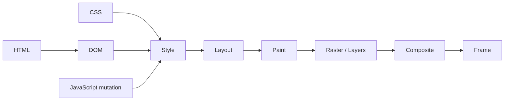

# Browser Rendering Pipeline: Layout, Paint & Compositing

**Seviye:** Junior → Staff  
**Alan:** Frontend / Browser Internals

## Konu anlatımı
Browser HTML/CSS/JS ve diğer kaynakları ekrandaki pixel'lere dönüştürürken DOM/style hesaplama, layout, paint, rasterization ve compositing gibi aşamalardan geçer. Bir UI değişikliğinin maliyeti hangi aşamaları yeniden tetiklediğine bağlıdır.

**Layout** geometrinin hesaplandığı katmandır: element nerede ve ne kadar büyük? **Paint** görsel çizim operasyonlarını üretir. **Rasterization** bu operasyonları pixel/tile sonuçlarına dönüştürür. **Compositing** ise layer sonuçlarını doğru sırada birleştirip frame üretir. `transform` ve `opacity` gibi bazı değişiklikler uygun koşullarda layout/paint işini azaltıp compositor ağırlıklı ilerleyebilir; bu her elementin ayrı layer olması gerektiği anlamına gelmez.

JavaScript DOM/style write yaptıktan hemen sonra `getBoundingClientRect()`, `offsetWidth` gibi geometry read isterse browser pending style/layout işini senkron tamamlamak zorunda kalabilir. Read/write'ları döngü içinde karıştırmak repeated forced layout, yani layout thrashing üretebilir.

## Mental model

`mutation → invalidation → gereken en erken pipeline aşamasından tekrar çalışma`

## İçeride ne oluyor?
1. Parser DOM'u; CSS sistemi style bilgisini üretir veya günceller.
2. Style invalidation hangi elementlerin style'ının yeniden hesaplanacağını belirler.
3. Layout box geometry'yi hesaplar.
4. Paint görünür içeriği çizim operasyonlarına dönüştürür.
5. Rasterization layer/tile içeriğini pixel'lere çevirir.
6. Compositor layer'ları birleştirip frame üretir.
7. DOM/style mutation pending work yaratabilir.
8. Geometry read pending layout'a bağımlıysa synchronous layout tetiklenebilir.
9. Long main-thread task input processing ve rendering fırsatlarını geciktirerek interaction latency'yi yükseltir.

## Yüksek getirili mülakat soruları
1. Layout, paint ve composite arasındaki fark nedir?
2. `transform: translate()` neden çoğu durumda `left/top` animasyonundan daha ucuz olabilir?
3. Forced synchronous layout nedir?
4. Layout thrashing nasıl oluşur ve nasıl azaltılır?
5. Compositor layer sayısını sınırsız artırmak neden kötü olabilir?
6. `will-change` neden her elemente eklenmemelidir?
7. Staff: lab benchmark ile gerçek kullanıcı INP/LCP verisi çelişirse nasıl triage edersin?

## Beklenen cevap derinliği
- **Junior:** DOM/style/layout/paint/composite sırasını ve temel farkları anlatır.
- **Mid:** invalidation, frame budget, read/write batching ve DevTools timeline kullanır.
- **Senior:** main thread/compositor ayrımı, raster, layer memory ve forced-layout trade-off'larını tartışır.
- **Staff:** RUM + trace + device class + percentile yaklaşımıyla performance budget ve rollout tasarlar.

## Kısa alıştırma
100 kartın her iterasyonda width'ini değiştirip hemen `offsetWidth` okuyan bir loop yaz. Sonra tüm read'leri ve write'ları iki ayrı faza ayır. Chrome DevTools Performance panelinde Layout event sayısı ve toplam süresini karşılaştır.

## Proje fikri
**render-pipeline-lab:** aynı animasyonu `left`, `transform` ve canvas ile kur. CPU throttling altında frame time, long task ve interaction latency ölç; sonucu teknik karar kaydında açıkla.

## Failure modes / trade-off / production bağlantısı
“Her şey compositor'da çalışır”, “GPU bedavadır”, “`will-change` her yere eklenmeli” veya “60 FPS tek başarı metriğidir” yaklaşımları yanlıştır. Layer promotion memory ve raster/upload maliyeti yaratabilir; gerçek kullanıcı cihazları lab makinesinden çok farklıdır. Production'da INP/LCP/CLS, long tasks ve RUM device/network segmentleri birlikte incelenmeli; regression release/canary ile korele edilmelidir.

## Kaynaklar
- Chrome for Developers — Blink: https://developer.chrome.com/docs/web-platform/blink
- Chrome for Developers — Performance: https://developer.chrome.com/docs/performance
- web.dev — Rendering performance: https://web.dev/articles/rendering-performance
- Chrome DevTools Performance: https://developer.chrome.com/docs/devtools/performance
