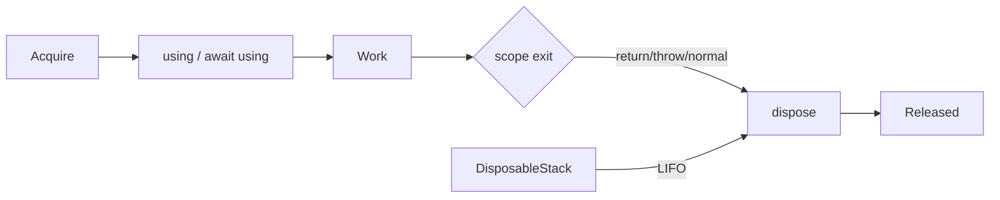

# ECMAScript Explicit Resource Management & Deterministic Cleanup

## Neden önemli?
GC memory reachability'yi yönetir; file descriptor, lock, transaction, stream veya temporary resource'ın ne zaman bırakılacağını garanti etmez. ECMAScript explicit resource management, resource ownership'i lexical scope ve standart dispose protocol'üne bağlar.

## Mental model

**Invariant:** GC lifetime ile external-resource lifetime aynı değildir; deterministic cleanup lexical ownership contract'ıdır.

## Temel kavramlar
- `using` disposable binding'i scope'a bağlar; `Symbol.dispose` scope completion'da çağrılır.
- `await using` / `Symbol.asyncDispose` asynchronous cleanup içindir.
- `DisposableStack` ve async karşılığı birden çok cleanup action'ını LIFO toplar.
- Early return ve throw cleanup'ı atlamamalıdır.
- Work ve cleanup birlikte hata verdiğinde original failure bilgisini koruyan suppressed-error semantics önemlidir.
- Resource'u lexical scope dışına kaçırmak disposed-resource use-after-close bug'ı yaratabilir.

## Mülakat soruları
1. GC varken deterministic disposal neden gerekir?
2. `using` ile `try/finally` ilişkisi nedir?
3. Cleanup neden LIFO'dur?
4. `await using` latency budget'ını nasıl etkiler?
5. Resource scope dışına kaçarsa ne olur?
6. Senior: transaction + lock + stream ownership sırasını tasarla.
7. Senior: work ve dispose birlikte hata verirse telemetry nasıl olmalı?
8. Staff: library API'larında disposable protocol adoption'ını nasıl standardize edersin?

## Seviye beklentisi
- **Junior:** GC ve explicit cleanup farkını açıklar.
- **Mid:** sync/async disposal, LIFO ve exception path'lerini yönetir.
- **Senior:** ownership transfer, double-dispose, cleanup failure ve latency etkisini tartışır.
- **Staff:** framework/library contract, telemetry ve compatibility standardı kurar.

## Mini alıştırma
DB connection, transaction ve temporary file kullanan request handler için normal return, query exception ve cleanup exception yollarını çiz. Cleanup sırasını ve async cleanup timeout bütçesini belirt.

## Proje
`resource-lifetime-lab`: `Symbol.dispose`/`Symbol.asyncDispose` implement eden mock resources ve stack tabanlı pipeline. Early return, nested throw, slow async dispose ve cleanup failure fault injection ekle; leaked-resource count ve disposal latency ölç.

## Failure modes / trade-off / production
GC'nin dış kaynağı zamanında kapatacağını varsaymak, ownership'i belirsiz bırakmak, resource'u scope dışına kaçırmak, async cleanup'ı deadline'dan bağımsız bırakmak ve cleanup telemetry'sini yutmak tipik hatalardır. Open-resource gauge, cleanup error, disposal duration, timeout ve pool exhaustion izlenir.

## Kaynaklar
- TC39 — ECMAScript living specification: https://tc39.es/ecma262/
- TC39 — Explicit Resource Management: https://tc39.es/proposal-explicit-resource-management/
- TC39 — Async Explicit Resource Management: https://tc39.es/proposal-async-explicit-resource-management/
