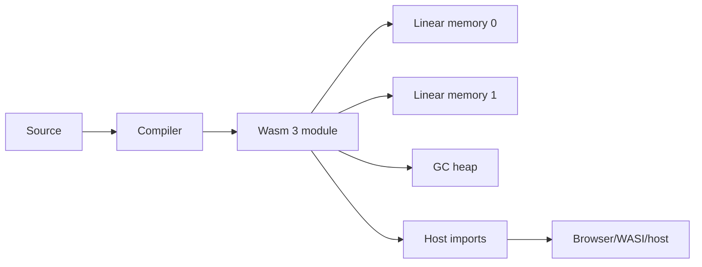

# WebAssembly 3.0: memory64, Multiple Memories & Runtime Boundaries

## Konu anlatımı
WebAssembly 3.0, 17 Eylül 2025'te tamamlanan güncel Wasm standardıdır. Başlıca ekler: `memory64`, module içi multiple memories, GC heap types, typed references, tail calls, native exception handling, relaxed SIMD ve deterministic execution profile. `memory64` linear-memory address type'ını `i64` yapabilir; bu fiziksel RAM garantisi değildir. Multiple memories code/data, trusted/untrusted state veya instrumentation bölgelerini ayrı address spaces olarak modellemeyi kolaylaştırır.

Wasm memory safety ile host capability security farklı katmanlardır. Module'ın filesystem/network/clock gibi gerçek authority'sini imports ve embedding belirler. Wasm GC de source-language runtime'ını hazır vermez; compiler'a struct/array/reference tabanlı managed heap primitive'leri verir.

## Mental model

**Invariant:** memory-safe module, aşırı yetkili host import'ları varsa least-authority sandbox değildir.

## İçeride ne oluyor?
- Validation type/control-flow correctness'i execution öncesi kontrol eder.
- `memory64` 64-bit addressing sağlar; pointer width ABI ve footprint'i etkileyebilir.
- Multiple memories tek module içinde ayrı address spaces sağlar.
- GC struct/array heap types ve typed references sunar; object model compiler sorumluluğudur.
- Tail calls stack growth olmadan transfer; native exceptions host escape olmadan structured error flow sağlar.
- Deterministic profile reproducibility gereken embedding'ler için ortak sonuç davranışı tanımlar.

## Mülakat soruları
1. Wasm JVM/container ile aynı şey midir?
2. Linear memory nedir?
3. `memory64` neyi çözer/ne çözmez?
4. Multiple memories security boundary midir?
5. Wasm GC neden source-language GC ile aynı değildir?
6. Senior: memory64 migration risklerini nasıl benchmark edersin?
7. Staff: browser/edge/server sandbox için Wasm seçimini nasıl yaparsın?
8. Staff: host capability API'sini least-authority nasıl tasarlarsın?

## Beklenen cevap seviyesi
- **Junior:** module, memory, import/export ayrımını bilir.
- **Mid:** validation, ABI ve host boundary maliyetini açıklar.
- **Senior:** memory64/multi-memory/GC özelliklerini workload ile bağlar.
- **Staff:** capability model, compatibility, cold start, observability ve supply-chain riskini tasarlar.

## Mini alıştırma
Image-processing module için input/output/secret config bölgelerini tek-memory ve three-memory tasarımla kıyasla; filesystem/network authority veren import'ları işaretle.

## Proje fikri
`wasm3-runtime-lab`: native ve Wasm compute kernel'ini module size, instantiate time, throughput, peak memory ve host-call overhead ile karşılaştır; engine destekliyorsa memory32/memory64 varyantı ekle.

## Failure modes / trade-off / production
Wasm'ı otomatik security sandbox sanmak, unrestricted imports, pointer-width maliyetini yok saymak, feature support kontrol etmemek ve chatty host API tipik hatalardır. Instantiate/compile latency, traps, memory growth, host-call latency, cache hit ve capability violations izle.

## Kaynaklar
- WebAssembly — Wasm 3.0 Completed: https://webassembly.org/news/2025-09-17-wasm-3.0/
- WebAssembly — Specifications: https://webassembly.org/specs/
- WebAssembly — Feature Status: https://webassembly.org/features/
