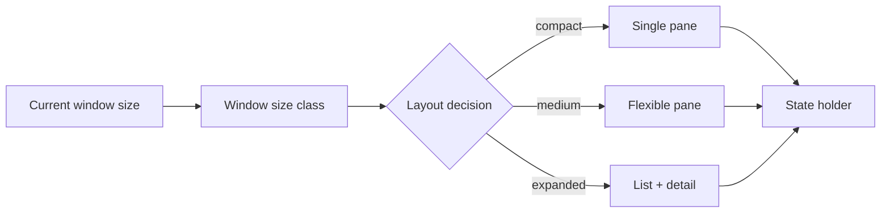

# Android Adaptive Layouts, Window Size Classes & State Preservation

## Konu anlatımı
Modern Android UI tasarımında cihaz modelini değil mevcut window'u düşünmek gerekir. Telefon, tablet, foldable, split-screen ve desktop windowing aynı uygulamayı farklı boyutlarda çalıştırabilir. Android 16'yı (API 36) hedefleyen uygulamalarda `sw600dp` ve üzeri display'lerde orientation, aspect-ratio ve resizability kısıtları varsayılan olarak yok sayılır; Android 17/API 37 hedefinde geçici opt-out kaldırılır.

Window boyutu rotation, fold/unfold, multi-window veya desktop resize ile runtime'da değişebilir. Adaptive UI; state'in configuration change sırasında korunması, layout kararının window size class üzerinden verilmesi ve navigation/content density'nin available space'e göre değişmesi demektir.

Responsive layout aynı yapıyı akışkan biçimde ölçekleyebilir; adaptive layout breakpoint/size-class değiştiğinde yapısal kompozisyonu değiştirebilir. Compact'ta listeden detail'e navigation yapılırken expanded window'da list + detail yan yana gösterilebilir.

## Mental model

**Invariant:** UI state ekran geometrisine ait değildir; window yeniden boyutlansa veya Activity recreate olsa da kullanıcı bağlamı korunmalıdır.

## İçeride ne oluyor?
- Android 16/API 36 hedefinde large-screen (`smallest width >= 600dp`) orientation/aspect/resizability restrictions ignore edilir; temporary opt-out vardır.
- Android 17/API 37 hedefinde bu large-screen davranışının temporary opt-out'u kaldırılır.
- Window size classes cihaz ismi yerine kullanılabilir alanı sınıflandırır.
- Configuration change varsayılan olarak Activity recreation tetikleyebilir; form/input/navigation state uygun state holder'da korunmalıdır.
- Fold/unfold ve desktop resize aynı process yaşamında birçok geometry transition üretebilir.
- Camera/viewfinder gibi sensor-aspect bağımlı yüzeyler rotation/crop/aspect testleri gerektirir.

## Yüksek getirili mülakat soruları
1. Responsive ve adaptive layout farkı nedir?
2. Neden `tablet mi?` yerine window size ölçmek daha doğrudur?
3. Configuration change sırasında hangi state korunmalı?
4. Orientation lock neden modern large-screen stratejisi değildir?
5. List-detail UI compact ve expanded window'da nasıl değişir?
6. Mid: fold/unfold sırasında duplicate network request'i nasıl önlersin?
7. Senior: adaptive UI test matrix'ini nasıl kurarsın?
8. Staff: legacy fixed-layout uygulamayı telemetry ve rollout guardrail'leriyle nasıl migrate edersin?

## Seviyeye göre cevap derinliği
- **Junior:** responsive layout, rotation ve state preservation.
- **Mid:** size-class tabanlı composition ve ViewModel/state-holder lifecycle.
- **Senior:** multi-window/fold/configuration testleri, performance ve accessibility.
- **Staff:** migration architecture, design-system primitives, analytics ve compatibility rollout.

## Kısa alıştırma
E-posta uygulaması için compact/medium/expanded durumlarda navigation ve list-detail davranışını çiz. Kullanıcı draft yazarken window iki kez resize olursa hangi state'in UI tree dışında tutulacağını belirt.

## Proje fikri
`adaptive-mail-lab`: Compose ile list/detail demo yap. Window size class değişimlerinde single-pane ve dual-pane arasında geç; selected item ve draft state'i koru. Rotation, foldable emulator, split-screen ve desktop resize testlerini otomatikleştir.

## Failure modes / trade-off / production bağlantısı
Device-type branching, hard-coded width, orientation lock'a güvenmek, resize sırasında state kaybetmek, dual-pane'de duplicate navigation/event üretmek ve yalnız portrait phone screenshot test etmek tipik hatalardır. Crash/ANR'ı window class'a göre kır, resize sonrası state-loss event'lerini ölç, layout overflow/accessibility telemetry'si ve large-screen engagement trendlerini izle.

## Kaynaklar
- Android Developers — App orientation, aspect ratio, and resizability: https://developer.android.com/develop/adaptive-apps/guides/app-orientation-aspect-ratio-resizability
- Android Developers — Android 16 behavior changes: https://developer.android.com/about/versions/16/behavior-changes-16
- Android Developers — Android 17 orientation/resizability restrictions: https://developer.android.com/about/versions/17/changes/ff-restrictions-ignored
- Android Developers — Support different display sizes: https://developer.android.com/develop/adaptive-apps/guides/support-different-display-sizes
