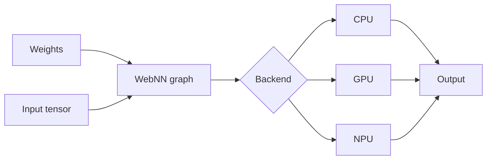

# WebNN, On-Device Inference & Hardware Abstraction

## Konu anlatımı
Web Neural Network API (WebNN), neural-network inference graph'larını web uygulamasından platformun CPU/GPU/NPU backend'lerine taşınabilir biçimde iletmeyi hedefleyen düşük seviyeli bir W3C API'sidir. 4 Eylül 2026 Candidate Recommendation Draft; transformer operator kapsamı, `MLTensor` buffer sharing ve abstract device selection gibi yetenekler içerir.

On-device inference server RTT ve cloud compute maliyetini azaltabilir, offline ve privacy özelliklerini güçlendirebilir. Buna karşılık model dağıtımı, browser/device heterojenliği, memory, thermal/battery ve operator support uygulama mimarisine taşınır.

## Mental model
WebNN'i “portable inference graph + platform-selected accelerator” olarak düşün. Portability, performance uniformity değildir. Aynı graph farklı cihazlarda farklı compile latency, memory copy, power ve operator implementation özellikleri gösterebilir.

## İçeride ne oluyor?
Graph build operator/shape/type ilişkilerini tanımlar. Runtime graph'ı platform primitive'lerine map eder. Buffer sharing kopyaları azaltabilir; özellikle camera/audio pipeline'larında transfer overhead kritik olabilir. Device selection peak compute'tan ibaret değildir: transfer, memory, thermal ve operator coverage birlikte değerlendirilir.

## Mülakat soruları
1. WebNN ile WebGPU'nun abstraction seviyesi nasıl farklıdır?
2. On-device inference neden otomatik olarak düşük latency demek değildir?
3. Tensor copy sayısı neden önemlidir?
4. Browser heterojenliğinde fallback nasıl tasarlanır?
5. Senior: model cache/version rollout nasıl yönetilir?
6. Staff: CPU/GPU/NPU benchmark matrisi nasıl kurulur?
7. Principal: privacy, cloud spend, quality ve client operability nasıl tek karara bağlanır?

## Seviyeye göre cevap derinliği
- **Mid:** graph/tensor/backend/fallback.
- **Senior:** copy, warmup, cache, thermal, compatibility.
- **Staff:** capability detection, device tiers, rollout policy.
- **Principal:** fleet economics, privacy ve ürün SLO'su.

## Mini alıştırma
Cloud, WebNN-NPU, WebNN-GPU ve WASM-CPU yollarını cold-start, p95, privacy, battery ve compatibility açısından puanla; routing policy çıkar.

## Proje fikri
`webnn-inference-lab`: küçük modeli WebNN ile çalıştır, WASM/server fallback ekle; model-load, graph compile, first inference, steady-state p50/p95 ve fallback rate ölç.

## Failure modes / trade-off / production
Unsupported operator, shape mismatch, cache miss, OOM, compile spike, thermal throttling ve silent fallback latency regression. Capability/backend distribution, load/compile latency, p95, fallback, crash/OOM ve model-version adoption izlenmelidir.

## Kaynaklar
- W3C Web Neural Network API — 4 Sep 2026 Candidate Recommendation Draft: https://www.w3.org/TR/webnn/
- W3C publication history: https://www.w3.org/standards/history/webnn/
- Web Platform Tests: https://github.com/web-platform-tests/wpt/tree/master/webnn
