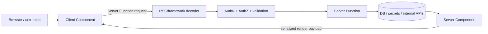

# React Server Components: Trust Boundaries & Patch Discipline

## Konu anlatımı
React Server Components (RSC), component execution'ın bir bölümünü browser bundle'ından çıkarıp build/request sırasında server ortamına taşır. Server Component data layer'a erişebilir ve Client Component'e render edilebilir veri/JSX aktarabilir. `"use client"` interaktif client boundary'sini; `"use server"` ise client'ın çağırabildiği Server Function sınırını belirtir — Server Component etiketi değildir.

Bu performans mimarisi aynı zamanda security boundary'dir. Client→Server Function çağrısı remote invocation'dır: payload güvenilmez; authentication, authorization, validation ve resource limits gerekir. React ekibi 3 Aralık 2025'te RSC decoding yolunda unauthenticated RCE (CVE-2025-55182, CVSS 10.0) açıkladı. Sonraki DoS/source-exposure bulguları nedeniyle 26 Ocak 2026 güncellemesinde tamamlanmış patch line'ları olarak 19.0.4, 19.1.5 ve 19.2.4 belirtildi.

## Mental model

**Invariant:** server'da çalışmak güvenli olmak demek değildir; decoder ve Server Function endpoint'i attack surface'tir.

## İçeride ne oluyor?
- Server Components implementation olarak browser'a gönderilmez; Client Components state/effect/browser API'lerini taşır.
- Boundary bundle size, serialization, caching ve secret exposure kararıdır.
- Server Functions authorization gerektiren RPC gibi ele alınmalıdır.
- React 19 RSC/Server Function framework integration API'leri framework yazarları için minor sürümler arasında semver-stable değildir; version pinning önemlidir.
- Patch management `react-server-dom-*`, framework ve bundler transitives'ini kapsamalıdır.

## Mülakat soruları
1. RSC ve SSR arasındaki execution/hydration farkı nedir?
2. `"use client"` ve `"use server"` neyi ifade eder?
3. Server Function neden local function gibi güvenilmemelidir?
4. Senior: secret/source exposure'ı nasıl önlersin?
5. Staff: kritik framework patch'ini canary + SBOM + rollback ile nasıl yönetirsin?
6. Principal: RSC'yi bundle/latency kazancı, framework coupling ve security patch velocity ile nasıl değerlendirirsin?

## Beklenen cevap seviyesi
- **Mid:** Server/Client Component ve Server Function rollerini ayırır.
- **Senior:** serialization, authz, cache, secret boundary ve patch failure mode'larını tartışır.
- **Staff:** dependency graph, canary, observability ve ownership tasarlar.
- **Principal:** platform standardı, blast radius ve security-response SLO'sunu ürün ekonomisine bağlar.

## Mini alıştırma
`updateInvoice(id, amount)` Server Function için validation, tenant authorization, idempotency ve audit noktalarını çiz. Ardından RSC decoder kritik CVE'si için 60 dakikalık patch/incident planı yaz.

## Proje fikri
`rsc-boundary-lab`: public catalog Server Component, authenticated mutation Server Function ve küçük Client Component kur. Authorization testleri, malformed-payload testleri, dependency inventory ve canary patch pipeline ekle; client JS bytes, TTFB ve server CPU'yu client-fetch yaklaşımıyla karşılaştır.

## Failure modes / trade-off / production bağlantısı
`"use server"` fonksiyonunu trusted call sanmak, yalnız UI'da authorization yapmak, secret'ı props'a serialize etmek, transitives'i patch dışında bırakmak ve ölçmeden her yere RSC uygulamak tipik hatalardır. RSC error rate, decoder failures, Server Function latency, authz denials, client JS bytes, vulnerability age ve patch rollout duration izlenmelidir.

## Kaynaklar
- React — Server Components: https://react.dev/reference/rsc/server-components
- React — Server Functions: https://react.dev/reference/rsc/server-functions
- React Security Advisory — 2025-12-03: https://react.dev/blog/2025/12/03/critical-security-vulnerability-in-react-server-components
- React follow-up — updated 2026-01-26: https://react.dev/blog/2025/12/11/denial-of-service-and-source-code-exposure-in-react-server-components