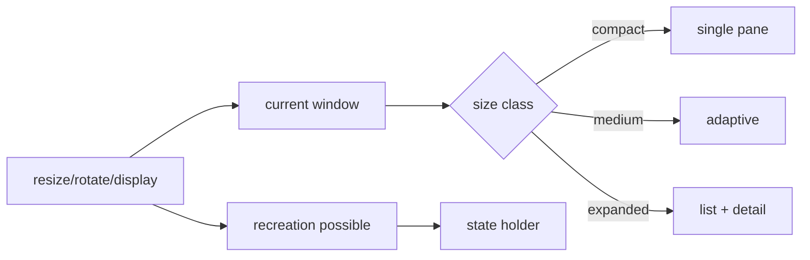

# Android 16 Desktop Windowing, Resizability & State Preservation

## Konu anlatımı
Android UI artık sabit “telefon portrait” modeliyle tasarlanamaz. Android 16 büyük ekranlarda resizability'yi baseline davranışa taşır; Android 16 QPR3 ile desteklenen telefonlarda external-display desktop windowing 3 Mart 2026'da GA olarak duyuruldu. Runtime boyunca pencere boyutu değişebilir ve configuration change Activity recreation yaratabilir.

## Mental model

**Invariant:** device modeli değil current window size runtime input'tur; state layout ağacının ömrüne bağlanmamalıdır.

## İçeride ne oluyor?
- API 36 hedefinde large-screen ortamlarında resizability baseline'dır.
- Desktop windowing free-form/maximized windows ve multi-app kullanım getirir.
- Window size classes device-name branching yerine current dimensions üzerinden layout seçer.
- Activity recreation için ephemeral UI state, screen state ve durable domain state ayrılmalıdır.
- External display farklı density/aspect ratio/input özelliklerine sahip olabilir; keyboard, mouse, focus, camera/viewfinder ve drag/drop ayrıca test edilmelidir.

## Mülakat soruları
1. Responsive ve adaptive UI farkı nedir?
2. Neden `isTablet` yerine window size tercih edilir?
3. Recreation sırasında state nerede yaşamalı?
4. Senior: resize sırasında request/selection state'i nasıl korunur?
5. Staff: form-factor test matrisini nasıl küçültüp risk coverage korunur?

## Beklenen cevap derinliği
- **Junior:** configuration change, responsive layout, state preservation.
- **Mid:** size classes, recreation ve state holder.
- **Senior:** multi-window/input/media/performance edge cases.
- **Staff:** adaptive design system ve otomatik test standardı.

## Mini alıştırma
Master-detail ekranını compact'ta tek pane, expanded'da iki pane yap. Selection ve form input'u resize + Activity recreation sonrasında koru; UI-only ve durable state'i ayır.

## Proje fikri
`adaptive-workbench`: Compose mail/task uygulaması; compact/medium/expanded layouts, keyboard shortcuts, drag/drop ve process-death restoration. Window-size screenshot/instrumentation test matrisi ekle.

## Failure modes / trade-off / production
Sabit width/height, orientation lock, tüm state'i local widget state'e koymak, resize sırasında pahalı işi tekrar çalıştırmak ve keyboard/mouse/focus erişilebilirliğini yok saymak tipik hatalardır. Crash/ANR, state-loss, overflow ve slow-frame metriklerini window mode'a göre segmentle.

## Kaynaklar
- Android Developers, 3 Mart 2026 — https://developer.android.com/blog/posts/android-devices-extend-seamlessly-to-connected-displays
- https://developer.android.com/develop/adaptive-apps/guides/support-desktop-windowing
- https://developer.android.com/develop/adaptive-apps/guides/app-orientation-aspect-ratio-resizability
