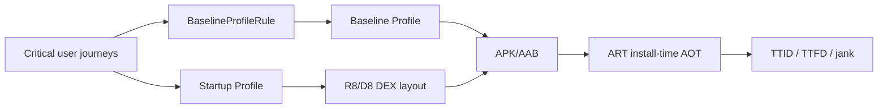

# Android Baseline Profiles, ART AOT/JIT & Startup Performance

**Seviye:** Junior → Staff  
**Alan:** Frontend / Mobile / Runtime Performance

## Konu anlatımı
Android startup performansı yalnız UI/rendering problemi değildir; ART'ın kodu interpretation, JIT ve AOT arasında nasıl çalıştırdığı da first-run latency'yi belirler. Baseline Profile, kritik user journey'lerde kullanılan class/method yollarını uygulamayla birlikte taşıyarak ART'ın install-time profile-guided AOT compilation kararını yönlendirir. Böylece yeni kurulum/update sonrası Cloud Profile'ın oluşmasını beklemeden kritik yollar optimize edilebilir.

Startup Profile farklı katmandadır: R8/D8 build-time'da startup için kritik kodun DEX layout'unu iyileştirmek için profile bilgisini kullanır. Baseline Profile on-device compilation, Startup Profile ise code layout problemine odaklanır.

## Mental model

## İnvariant
Profile bir performans ipucudur; kötü startup architecture'ını düzeltmez. Gerçek başarı release-like benchmark ve production telemetry ile ölçülür.

## İçeride ne oluyor?
- Baseline Profile generator representative critical user journey'leri çalıştırarak rules üretir.
- Rules binary profile olarak APK/AAB ile taşınır.
- ART profile içindeki hot code'u AOT compile ederek interpretation/JIT warm-up maliyetini azaltabilir.
- Cloud Profiles gerçek kullanım verisiyle zamanla oluşur; Baseline Profile release'in ilk kullanıcılarındaki boşluğu kapatır.
- Startup Profile R8/D8'e DEX layout sinyali verir; startup code locality/page-fault davranışını iyileştirebilir.
- Macrobenchmark compilation modes profilesız ve profile-guided koşulları kontrollü karşılaştırmaya yarar.
- TTID ilk frame'i; TTFD gerçekten kullanılabilir durumu ölçer. İkisi birlikte değerlendirilmelidir.

## Mülakat soruları
1. JIT ve AOT trade-off'u nedir?
2. Baseline Profile first-run/update deneyimini neden etkiler?
3. Baseline Profile ile Startup Profile arasındaki fark nedir?
4. Debug build benchmark'ı neden yanıltır?
5. Profile coverage'ı neden sınırsız büyütülmemeli?
6. TTID iyileşip TTFD kötüleşirse ne olmuş olabilir?
7. Multi-module uygulamada profile generation ve regression gate nasıl tasarlanır?

## Beklenen cevap seviyesi
- **Junior:** JIT/AOT ve startup latency kavramlarını ayırır.
- **Mid:** Baseline vs Startup Profile ve Macrobenchmark rolünü açıklar.
- **Senior:** TTID/TTFD, release-like ölçüm, profile staleness ve code-layout trade-off'larını tartışır.
- **Staff:** CI generation, device matrix, performance budget ve production telemetry'yi tek lifecycle olarak tasarlar.

## Kısa alıştırma
Cold launch→home, search→result ve product→cart journey'leri için profile kapsamı ve metric seç. `CompilationMode.None` ile Baseline Profile enabled koşullarını karşılaştıracak deney tasarla; cache/device/build confounder'larını yaz.

## Proje fikri
`android-startup-lab`: Compose uygulamasına Baseline Profile generator ve Macrobenchmark ekle. Cold-start TTID/TTFD ile scroll frame timing'i profilesız/profilli ölç. Startup Profile'ı ayrıca açarak DEX-layout etkisini ayrı deney olarak raporla.

## Failure modes / trade-off / production
Yanlış journey profile'ı şişirir ve gerçek hot path'i kaçırır. Emulator veya debug build sahte sonuç üretir. Navigation değiştikçe profile stale olabilir. Deferred initialization TTID'yi iyileştirip TTFD/first-interaction jank'i kötüleştirebilir. Production'da startup percentiles, TTID, TTFD, jank/slow frames, ANR, release ve low-end-device cohort'ları izlenir.

## Kaynaklar
- Android Developers — Baseline Profiles overview: https://developer.android.com/topic/performance/baselineprofiles/overview
- Android Developers — Create Baseline Profiles: https://developer.android.com/topic/performance/baselineprofiles/create-baselineprofile
- Android Developers — Macrobenchmark: https://developer.android.com/topic/performance/benchmarking/macrobenchmark-overview
- Android Developers — Manually create and measure Baseline Profiles: https://developer.android.com/topic/performance/baselineprofiles/manually-create-measure
