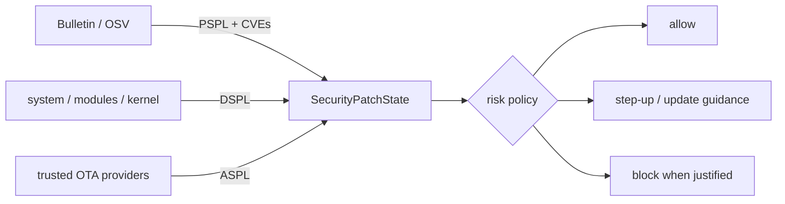

# AndroidX Security State: Component-Level Patch Posture

## Neden önemli?
Modern Android'de system image, Mainline modules ve kernel farklı update kanallarına sahiptir; tek security patch tarihi tüm posture'u anlatmaz. AndroidX Security State 1.1.0 ve Security State Provider 1.0.0 Eylül 2026'da stable oldu. Model DSPL (installed/running), PSPL (published) ve ASPL (available-to-install) sinyallerini component bazında ayırır ve CVE-level checks sağlayabilir.

## Mental model

**Invariant:** Patch posture bir risk sinyalidir; authentication veya compromise kanıtı değildir.

## Temel kavramlar
- DSPL local installed state, PSPL published bulletin state, ASPL cihaz için hazır update bilgisidir.
- System, system modules ve kernel ayrı değerlendirilir; kernel LTS version semantics kullanabilir.
- `areCvesPatched()` belirli vulnerability'ler için granular policy sağlar; supplemental vendor patches hesaba katılabilir.
- ASPL trusted update provider'larından IPC ile gelir; provider identity ve lifecycle güvenlik sınırının parçasıdır.
- Stable client deadlocked remote provider'lara karşı bounded thread-pool bulkhead içerir.
- Risk policy allow/warn/step-up/require-update seçeneklerini use case'e göre ayırmalıdır; patch lag'i otomatik compromise değildir.

## Mülakat soruları
1. Tek SPL tarihi neden yetersizdir?
2. DSPL, PSPL ve ASPL farkı nedir?
3. Patch posture device integrity/authentication'ın yerine geçer mi?
4. Provider timeout olduğunda sensitive flow ne yapmalı?
5. CVE bazlı blocking policy'de OEM backport ve false-positive nasıl yönetilir?
6. Fleet posture telemetry'sini privacy-preserving nasıl toplarsın?

## Beklenen cevap derinliği
- **Junior:** patch level ve system/module/kernel ayrımı.
- **Mid:** DSPL/PSPL/ASPL ve provider modeli.
- **Senior:** IPC failure, trusted provider, CVE checks, UX.
- **Staff:** risk policy, privacy, rollout, exception ve fleet governance.

## Mini alıştırma
System DSPL güncel; Mainline bir ay geride; ASPL update hazır; kritik NFC CVE'si yalnız bu modülü etkiliyor. Tap-to-pay, bakiye görüntüleme ve profil düzenleme için ayrı policy üret.

## Proje
`device-posture-demo`: AndroidX Security State ile component posture göster; `allow`, `warn`, `step-up`, `require-update` policy engine'i ve provider timeout simülasyonu ekle. Yalnız aggregate telemetry tut.

## Failure modes / production
Tek SPL string'ine güvenmek, lag'i compromise saymak, provider failure'ı otomatik unsafe kabul etmek, OEM backport'u yok saymak ve posture verisini gereksiz tracking'e çevirmek tipik hatalardır. Component posture, ASPL availability, provider errors/timeouts, policy decisions, update completion ve false-block support sinyallerini izle.

## Kaynaklar
- Android Developers Blog, 17 Eylül 2026: https://developer.android.com/blog/posts/introducing-the-android-x-security-state-libraries-a-unified-view-of-device-security
- Understand device security state: https://developer.android.com/privacy-and-security/understand-device-security-state
- AndroidX Security release notes: https://developer.android.com/jetpack/androidx/releases/security
