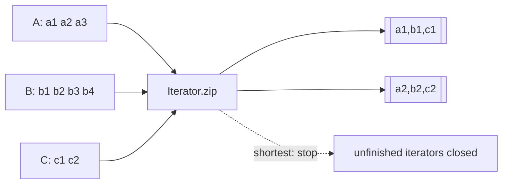

# JavaScript `Iterator.zip`, Lazy Joint Iteration & Length Semantics

## Konu anlatımı
Birden çok sequence pozisyonel olarak ilişkiliyse index tabanlı paralel array dolaşımı iterable abstraction'ını kaybeder, materialization gerektirebilir ve uzunluk uyuşmazlığını gizleyebilir. TC39 Joint Iteration Stage 4'e ulaştı ve ECMAScript 2027'ye entegre edildi. `Iterator.zip()` tuple-benzeri arrays, `Iterator.zipKeyed()` key'li objects üretir. Chrome 153, 8 Eylül 2026 itibarıyla API'leri stable kanalda duyurdu.

**Mental model:** zip bir materialization değil, birden çok iterator üzerinde senkron `next()` koordinasyonudur.

## Semantics
- Sonuç lazy iterator'dır.
- `shortest` varsayılandır; ilk input bitince sonuç biter ve unfinished iterators kapatılır.
- `longest` tüm input'lar bitene kadar sürer; eksikler `padding` veya `undefined` olur.
- `strict` eşit olmayan uzunlukta `TypeError` üretir.
- `zipKeyed` positional array yerine input object key'lerini korur.

## Mülakat soruları
1. `zip` ile index-based `map` farkı nedir?
2. Lazy evaluation memory ve first-result latency'yi nasıl etkiler?
3. `shortest`, `longest`, `strict` hangi data-contract'lara karşılık gelir?
4. Unfinished iterator'ların kapatılması neden önemlidir?
5. Infinite iterable ve side-effectful iterator durumunda hangi riskler doğar?
6. Staff: silent truncation ile strict validation arasında nasıl karar verirsin?

## Seviye beklentisi
- **Junior:** iterable/iterator ve `next()`.
- **Mid:** mode/padding/cleanup semantics.
- **Senior:** side effects, errors, infinite inputs, memory/latency.
- **Staff:** compatibility, data contracts, rollout ve telemetry.

## Alıştırma / proje
`A=[1,2,3]`, `B=[10,20]`, `C=[100,200,300,400]` için üç mode'un çıktısını yaz. Ardından `iterator-zip-lab` ile 10M satırlık CSV kolon stream'lerini zip ve materialized index yaklaşımıyla karşılaştır; heap, throughput ve first-result latency ölç.

## Failure modes / production
Silent truncation, `undefined` padding'in downstream'e sızması, infinite iterable'ı yanlış modda kullanmak, cleanup'ı unutmak ve browser support'u varsaymak başlıca risklerdir. Mismatch count, consumed rows, rejected batches, latency ve memory high-water mark izlenmelidir.

## Kaynaklar
- Chrome 153: https://developer.chrome.com/blog/new-in-chrome-153
- TC39 Joint Iteration: https://tc39.es/proposal-joint-iteration/
- ECMAScript 2027: https://tc39.es/ecma262/multipage/control-abstraction-objects.html
