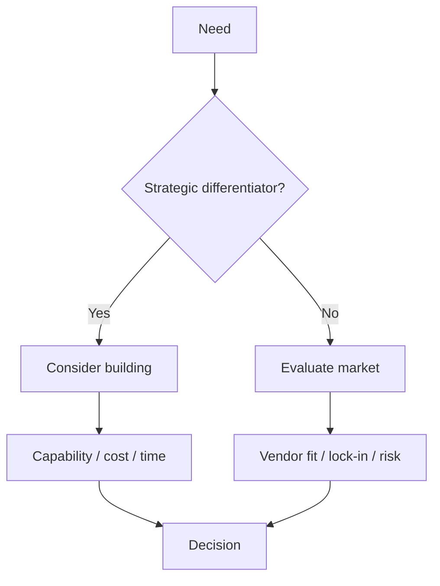

# Build vs Buy ve Platform Strategy

Teknik liderlikte doğru soru yalnızca “hangi teknoloji daha iyi?” değildir. Asıl soru çoğu zaman şudur:

> Bu yetenek şirket için stratejik bir farklılaştırıcı mı, yoksa güvenilir biçimde satın alınabilecek bir commodity mi?

## Karar boyutları

- geliştirme ve bakım maliyeti,
- ekip uzmanlığı,
- time-to-market,
- güvenlik ve compliance,
- reliability / on-call yükü,
- migration ve exit cost,
- vendor lock-in,
- opportunity cost,
- ölçek büyüdükçe unit economics.

## Platform ne zaman anlamlıdır?

Birçok takım aynı authentication, observability, deployment veya storage problemini tekrar çözüyorsa platformlaştırma standardizasyon ve developer velocity sağlayabilir. Ancak erken platform yatırımı yeni bir koordinasyon katmanı da yaratabilir.

## Mülakat soruları

1. Build vs buy kararını nasıl verirsin?
2. Vendor lock-in her zaman kötü müdür?
3. Platform ekibi ne zaman kurulmalı?
4. Internal platform'un başarısı nasıl ölçülür?
5. Teknik borç business diliyle nasıl anlatılır?
6. Migration ROI'si nasıl değerlendirilir?
7. 30 takım aynı problemi farklı çözüyor; neyi merkezileştirirsin?

## Seviye beklentisi

- **Senior:** lokal teknik trade-off'u açıklar.
- **Staff:** takımlar arası mimari ve operasyon etkisini görür.
- **Principal:** standardizasyon ve migration stratejisi kurar.
- **EM:** ownership, staffing ve adoption tarafını yönetir.
- **CTO:** teknoloji kararını ürün, finans, risk ve organizasyonla birlikte değerlendirir.

## Uygulama

Authentication, observability ve feature flag için üç seçeneği karşılaştır: kendi ürününü geliştirme, managed service, open-source self-hosting. Stratejik değer, ekip kapasitesi, cost, time-to-market, lock-in ve reliability ölçütlerini puanla.

## Habitat bağlantısı

Habitat-benzeri storage platformu klasik bir platform yatırım örneğidir: routing, authorization, tenancy ve request shaping tekrarını azaltabilir. Buna karşılık ortak platform kritik path'e girdikçe reliability sorumluluğu ve etki alanı da merkezileşir.

## Ana kaynaklar

- AWS Well-Architected Framework: https://docs.aws.amazon.com/wellarchitected/latest/framework/welcome.html
- Google Cloud Architecture Framework: https://cloud.google.com/architecture/framework
- Martin Fowler — Platform Engineering: https://martinfowler.com/articles/platform-engineering.html
