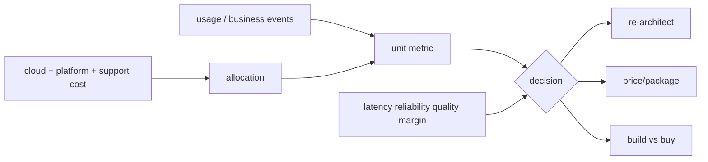

# Cloud Unit Economics, Cost-to-Serve & Architecture Decisions

## Konu anlatımı
Toplam cloud faturası tek başına engineering verimliliğini göstermez. Trafik veya gelir daha hızlı büyüyorsa mutlak maliyet artarken ekonomi iyileşebilir. Unit economics teknoloji maliyetini anlamlı bir birime bağlar: cost/transaction, cost/tenant, cost/GB served, cost/successful inference veya cost/case resolved.

FinOps Foundation resource-efficiency unit metrics ile business-unit metrics'i ayırır. CTO seviyesinde amaç yalnız cost cutting değil; unit cost'u latency, reliability, product outcome ve gross margin ile birlikte optimize etmektir. Shared platform, observability, egress ve support maliyetlerinin allocation yöntemi açık olmalı; fixed/shared cost ile variable/marginal cost karıştırılmamalıdır.

## Mental model

## İçeride ne oluyor?
- Basit unit cost = attributable cost / meaningful unit count.
- Numerator scope, denominator semantics ve zaman penceresi version'lanmalıdır.
- Shared cost allocation yanlışsa ekip teşvikleri bozulur.
- Tenant mix değişimi ortalamayı yanıltır; cohort cost-to-serve gerekebilir.
- Commit/reservation unit price'ı düşürür fakat demand uncertainty ve lock-in getirir.
- GenAI'da cost/token teknik sinyal; cost/successful task business outcome'a daha yakındır.
- Unit cost kalite/SLO guardrail'leri olmadan optimize edilmemelidir.

## Mülakat soruları
1. Cloud faturası %30 arttı; neden tek başına kötü haber değildir?
2. Cost/request ve cost/successful transaction neden farklıdır?
3. Shared platform maliyetini nasıl dağıtırsın?
4. Reservation/commit hangi riskleri taşır?
5. Multi-tenant SaaS'ta pahalı müşteri nasıl bulunur?
6. Managed vs self-hosted DB için TCO'ya neler girer?
7. CTO: unit cost, margin, reliability ve roadmap velocity çatışırsa nasıl karar verirsin?

## Seviye beklentisi
**Senior:** attribution ve fixed/variable cost. **Staff:** architecture/capacity kararları ve quality guardrails. **Principal:** TCO, commitments ve portfolio trade-off. **CTO:** pricing, gross margin, vendor leverage ve yatırım temposu.

## Mini alıştırma
Compute $60k, DB $25k, egress $10k, observability $5k ve 20M başarılı işlem için cost/success hesapla. Cache compute'u $15k azaltıp egress'i $8k artırıyorsa yeni unit cost'u ve net değişimi bul; karar için eksik product/reliability metric'lerini yaz.

## Proje fikri
Billing export ile request/business telemetry'yi birleştirip service ve tenant bazında cost/request, cost/success ve gross-margin proxy dashboard'u kur. Shared-cost allocation stratejisini değiştirilebilir ve metric tanımlarını version'lı yap.

## Failure modes / trade-off / production
Yanlış denominator metric gaming yaratır; average pahalı cohort'u gizler; eksik egress/observability/support build-vs-buy kararını çarpıtır; amortized commitment ile marginal cost karışabilir. Unit-cost trendi attribution coverage, idle/headroom, commitment utilization, p99, error budget ve business outcome ile birlikte okunmalıdır.

## Kaynaklar
- FinOps Foundation — Unit Economics: https://www.finops.org/framework/capabilities/unit-economics/
- FinOps Foundation — Terminology / TCO: https://framework.finops.org/assets/terminology/
