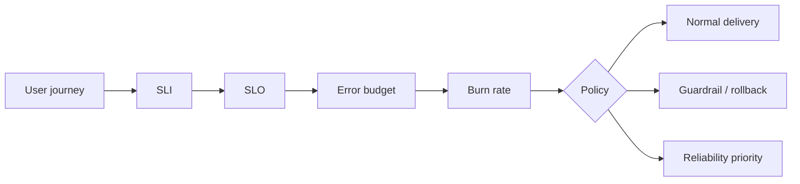

# Error Budgets, Burn Rate & Reliability Prioritization

## Neden önemli?
SLO kullanıcı açısından hedef reliability seviyesidir. Error budget, kabaca `1 - SLO`, kabul edilen failure payını engineering karar mekanizmasına çevirir. Amaç 100% uptime kovalamak değil; reliability ile change velocity arasında ölçülebilir bir kontrat kurmaktır.

## Mental model

## Burn rate
Burn rate, budget'ın SLO'nun izin verdiği hıza göre tüketim oranıdır. `1x` hız tüm pencere boyunca sürerse budget pencere sonunda biter; `10x` yaklaşık onda bir sürede tüketir. Multi-window yaklaşım fast-burn outage ile slow-burn degradation'ı ayırmaya yardım eder.

## Policy, dashboard'dan önemlidir
Error-budget policy; SLI kapsamını, excluded traffic'i, budget tükenince uygulanacak change/release kurallarını, security exception'larını, owner/escalation'ı ve exit criteria'yı önceden tanımlar. Böylece incident anında reliability-vs-feature tartışması yeniden pazarlık edilmez.

## Organizasyon seviyesi
- Mid: SLI/SLO/budget hesabı.
- Senior: burn-rate alert, rollback/canary gate ve dependency attribution.
- Staff: service tiering, cross-team policy, exception governance.
- CTO: reliability target'ını customer expectation, revenue/reputation risk, compliance ve engineering allocation ile bağlama.

## Mülakat soruları
1. SLI/SLO/SLA farkı nedir?
2. %99.9 SLO'nun budget'ı nedir?
3. Burn rate 1x/10x ne demektir?
4. Remaining-budget alert neden tek başına zayıftır?
5. Dependency outage nasıl ele alınır?
6. Feature freeze ne zaman uygulanır?
7. Birden çok user journey için SLO portföyü nasıl kurulur?
8. Daha yüksek SLO'nun business cost'u nasıl anlatılır?

## Alıştırma ve proje
30 günlük %99.9 request-success SLO ve 20M request için error budget'ı hesapla; 1 saatte 6K bad event'in budget spend'ini çıkar. Sonra rolling compliance, remaining budget ve fast/slow burn gate'leri hesaplayan `slo-control-loop` prototipi geliştir.

## Failure modes / trade-off
Yanlış SLI kullanıcı acısını ölçmez; gevşek SLO reliability debt'i gizler; aşırı sıkı SLO velocity/cost'u bozar; low-traffic service gürültü yaratabilir; dependency attribution yanlış teşvik oluşturabilir. SLO punishment değil, prioritization control loop'udur.

## Production telemetry
User-journey SLI, remaining budget, multi-window burn rate, incident başına budget spend, rollback frequency, change failure rate ve reliability work allocation birlikte izlenmelidir.

## Kaynaklar
- Google SRE Workbook — Implementing SLOs: https://sre.google/workbook/implementing-slos/
- Google SRE Workbook — Alerting on SLOs: https://sre.google/workbook/alerting-on-slos/
- Google SRE Workbook — Error Budget Policy: https://sre.google/workbook/error-budget-policy/
- Google SRE Book — Embracing Risk: https://sre.google/sre-book/embracing-risk/
