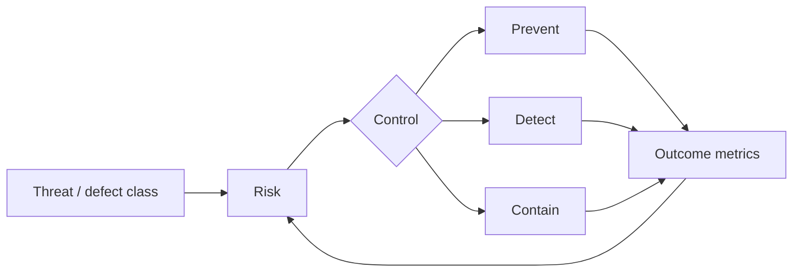

# Secure-by-Design Governance, SSDF & Security Economics

## Mental model
Security programı scanner/pentest sayısını değil sürdürülebilir risk azalımını optimize etmelidir.

## SSDF ve secure-by-design
NIST SSDF, güvenli geliştirme pratiklerini SDLC içine entegre etmek için ortak practice/task vocabulary sağlar. NIST, SSDF 1.2 initial public draft'ını 17 Aralık 2025'te yayımladı. Secure-by-design yaklaşımında hedef security işini yalnız son aşama gate'i yapmak değil; güvenli default'ları platform ve ürün tasarımına taşımaktır.

## Security economics
Kontroller risk azaltımı, time-to-value, engineering cost ve opportunity cost ile kıyaslanmalıdır. Bir defect class'ını kaynağında önleyen kontrol, tekrar tekrar detection/patch yapmaktan daha yüksek kaldıraç sağlayabilir. Memory-safe language migration bunun örneğidir; fakat interoperability, migration ve competency maliyeti hesaba katılmalıdır.

## Governance primitives
- paved-road / secure defaults
- dependency ve build provenance policy
- vulnerability response SLA
- risk exception: owner + rationale + expiry + compensating control
- exposure-weighted metrics
- root-cause recurrence feedback loop

## Mülakat soruları
1. Secure by design ile shift-left aynı şey midir?
2. Vulnerability count neden zayıf executive KPI olabilir?
3. Preventive ve detective control arasında nasıl seçim yaparsın?
4. Security exception lifecycle nasıl tasarlanır?
5. Memory-safe rewrite hangi durumda yatırım önceliği olur?
6. CTO: security, reliability ve feature velocity bütçesini nasıl dengelersin?

## Failure modes / production
Scanner count'u başarı sanmak, exception'ı süresiz bırakmak, AppSec'i approval bottleneck'e çevirmek, compliance'ı security ile eşitlemek ve rewrite riskini küçümsemek tipik hatalardır. Exposure-weighted vulnerability age, fix lead time, exception debt, secure-default adoption, recurrence ve incident impact izlenmelidir.

## Kaynaklar
- https://csrc.nist.gov/projects/ssdf
- https://csrc.nist.gov/pubs/sp/800/218/r1/ipd
- https://csrc.nist.gov/pubs/sp/800/218/a/final
- https://www.cisa.gov/news-events/alerts/2025/01/17/cisa-and-fbi-release-updated-guidance-product-security-bad-practices
