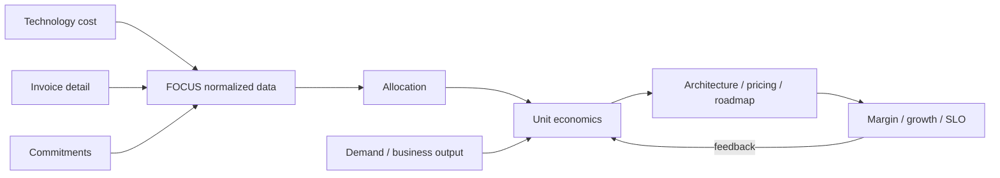

# FinOps Unit Economics, Allocation & Technology-Value Decisions

## Konu anlatımı
Toplam teknoloji maliyeti tek başına ürünün ekonomik verimliliğini anlatmaz. Unit economics teknoloji spend'ini üretilen teknik veya business value unit'iyle bağlar: cost per transaction, active customer, case resolved, inference/token veya benzeri. Böylece maliyet artışının büyümeden mi, verimsizlikten mi geldiği daha iyi ayrıştırılır.

FinOps Framework 2026, teknoloji değer yönetimini public cloud sınırının ötesine genişletir. Mart 2026 güncel tanımı FinOps'u teknoloji iş değerini maksimize eden, timely data-driven karar ve engineering-finance-business işbirliğiyle finansal accountability oluşturan operasyonel framework/kültürel pratik olarak ele alır. Unit metric'in güvenilirliği allocation'a bağlıdır: direct cost owner/product'a atanabilir; shared platform/network/support maliyeti fixed, proportional veya proxy-driver ile dağıtılabilir ya da bilinçli olarak merkezi tutulabilir.

FOCUS bu karar katmanının altında farklı teknoloji sağlayıcılarının billing verisini ortak schema ve terminolojiye taşır. FOCUS Steering Committee 1.4'ü 4 Haziran 2026'da ratify etti. 1.4 Invoice Detail ve Billing Period dataset'leriyle usage/cost kayıtlarını invoice reconciliation'a bağlar; commitment detayları ve eligibility alanlarıyla commitment coverage analizini güçlendirir. 1.4 zero incompatible changes hedefiyle yayımlandı. FOCUS 1.5 için AI model identity, input/output token consumption ve Price Sheet dataset'i roadmap kapsamındadır; bunlar 1.4 özelliği değildir.

## Mental model

**Invariant:** normalized cost data karar değildir; denominator, allocation policy ve ownership yanlışsa unit metric yanlış davranışı optimize eder.

## İçeride ne oluyor?
- Invoice reconciliation internal usage ledger ile vendor invoice arasındaki credits, corrections ve billing-period farklarını görünür kılar.
- Allocation account/tag/label ve derived metadata ile cost ownership kurar; shared cost fixed, proportional veya proxy metric ile dağıtılabilir.
- Commitment utilization “satın alınanın ne kadarı kullanıldı?”, coverage ise “eligible spend'in ne kadarı commitment tarafından karşılandı?” sorusudur.
- Unit Economics spend ile value/demand unit'ini bağlar. `cost/request` teknik, `cost/successful checkout` veya `cost/active customer` business kararı için daha anlamlı olabilir.
- Fully-loaded metric direct cloud cost'un ötesinde platform, security, observability, license ve ilgili teknoloji kategorilerini kapsayabilir.
- Metric definition, scope, allocation version ve owner açık olmalıdır; denominator drift trend'i bozabilir.
- Average unit cost yanında marginal cost, demand mix, SLO, quality ve revenue/margin guardrail'leri değerlendirilmelidir.

## Mülakat soruları
1. Toplam cost artarken unit cost düşüyorsa ne anlama gelebilir?
2. Showback, chargeback ve unit economics nasıl ayrılır?
3. Shared platform maliyetini hangi yöntemlerle allocate edersin?
4. Commitment utilization ve coverage neden farklı KPI'lardır?
5. Invoice reconciliation neden engineering için de önemlidir?
6. Staff: unit metric'i SLO ve product quality ile nasıl guardrail edersin?
7. Principal: architecture review'e unit economics'i nasıl eklersin?
8. CTO: %20 infra tasarrufu roadmap'i yavaşlatıyorsa kararı margin, growth, risk ve opportunity cost ile nasıl verirsin?

## Beklenen cevap seviyesi
- **Senior:** cost driver, allocation, commitment, denominator ve SLO trade-off'unu açıklar.
- **Staff:** ownership, shared-cost policy, reconciliation, metric pipeline ve anomaly loop kurar.
- **Principal/EM:** architecture/workload placement, forecast, optimization portfolio ve exception governance'i bağlar.
- **CTO:** portfolio, margin, pricing, vendor strategy, growth ve risk appetite'ı ortak value modelinde yönetir.

## Mini alıştırma
Aylık teknoloji maliyeti 400k→460k, başarılı transaction 8M→11.5M olan ürünün direct cost/transaction trend'ini hesapla. 60k shared observability/security maliyetini transaction volume'a göre allocate etmek ile eşit takım paylaştırmak arasındaki teşvik farkını tartış.

## Proje fikri
`focus-unit-economics-lab`: FOCUS-benzeri Cost and Usage + Invoice Detail + business KPI tablolarından warehouse kur. Product allocated cost, invoice reconciliation delta, commitment coverage ve `cost/successful_transaction` üret. Data freshness ve allocation version'ını metric metadata'sında göster.

## Failure modes / trade-off / production bağlantısı
Yanlış denominator, gizli unallocated cost, shared-cost dağıtımını mutlak gerçek sanmak, invoice ile usage ledger'ı reconcile etmemek, commitment utilization'ı coverage sanmak, denominator tanımını sessiz değiştirmek ve unit metric'i SLO/quality guardrail olmadan hedefe çevirmek tipik hatalardır. Invoice reconciliation delta, allocation coverage, unallocated %, commitment coverage/utilization, unit cost, marginal cost, forecast variance, SLO ve margin birlikte izlenir.

## Kaynaklar
- FOCUS — What is FOCUS? (1.4 latest): https://focus.finops.org/what-is-focus/
- FinOps Foundation — Introducing FOCUS 1.4, 10 Haziran 2026: https://www.finops.org/insights/introducing-focus-1-4/
- FinOps Foundation — What is FinOps? (updated March 2026): https://www.finops.org/introduction/what-is-finops/
- FinOps Foundation — Unit Economics: https://www.finops.org/framework/capabilities/unit-economics/
- FinOps Foundation — Allocation: https://www.finops.org/framework/capabilities/allocation/
