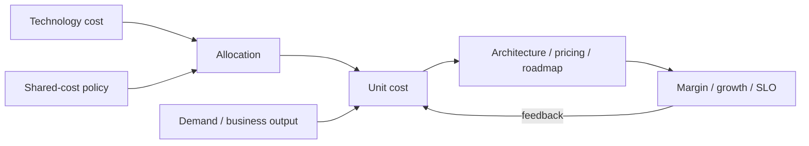

# FinOps Unit Economics, Allocation & Technology-Value Decisions

## Konu anlatımı
Toplam teknoloji maliyeti tek başına ürünün ekonomik verimliliğini anlatmaz. Unit economics teknoloji spend'ini üretilen teknik veya business value unit'iyle bağlar: cost per transaction, active customer, case resolved, inference/token veya benzeri. Böylece maliyet artışının büyümeden mi, verimsizlikten mi geldiği daha iyi ayrıştırılır.

FinOps Framework 2026, teknoloji değer yönetimini public cloud sınırının ötesine genişletir ve Executive Strategy Alignment capability'sini ekler. Unit metric'in güvenilirliği allocation'a bağlıdır: direct cost owner/product'a atanabilir; shared platform/network/support maliyeti fixed, proportional veya proxy-driver ile dağıtılabilir ya da bilinçli olarak merkezi tutulabilir. Amaç kusursuz muhasebe değil, karar için yeterince güvenilir ve açık bir modeldir.

## Mental model

**Invariant:** cost reduction tek başına value optimization değildir; denominator veya outcome yanlışsa unit metric yanlış davranışı optimize eder.

## İçeride ne oluyor?
- Allocation account/tag/label ve derived metadata ile cost ownership kurar.
- Shared cost fixed, proportional veya proxy metric ile dağıtılabilir; bazı maliyetler bilinçli merkezi tutulabilir.
- Unit Economics spend ile value/demand unit'ini bağlayarak engineering, product ve finance arasında ortak dil kurar.
- Fully-loaded metric direct cloud cost'un ötesinde platform, license ve ilgili teknoloji kategorilerini kapsayabilir.
- Metric definition, scope, version ve owner açık olmalıdır; denominator drift trend'i bozabilir.
- Average unit cost yanında marginal cost, demand mix, SLO ve quality de değerlendirilmelidir.

## Mülakat soruları
1. Toplam cost artarken unit cost düşüyorsa ne anlama gelebilir?
2. Cost per request neden her ürün için iyi business metric değildir?
3. Shared platform maliyetini hangi yöntemlerle allocate edersin?
4. Showback ve chargeback davranış açısından nasıl farklılaşır?
5. Average ve marginal unit cost ne zaman farklı karar üretir?
6. Staff: noisy-neighbor ve enterprise discount etkisini nasıl normalize edersin?
7. Principal: architecture review'e unit economics'i nasıl eklersin?
8. CTO: cost, margin, reliability ve growth için nasıl metric tree kurarsın?

## Beklenen cevap seviyesi
- **Senior:** cost driver, allocation, denominator ve SLO trade-off'unu açıklar.
- **Staff:** ownership, shared-cost policy, metric pipeline ve anomaly loop kurar.
- **Principal:** architecture/workload-placement kararlarını unit economics ve forecast ile bağlar.
- **CTO:** portfolio, margin, pricing, vendor strategy ve risk appetite'ı ortak value modelinde yönetir.

## Mini alıştırma
Aylık teknoloji maliyeti 300k→420k, başarılı transaction 100M→175M olan ürünün direct cost/transaction trend'ini hesapla. 80k shared platform cost'unu transaction volume'a göre allocate et ve sonucu SLO'nun 99.9→99.99 iyileşmesiyle birlikte yorumla.

## Proje fikri
`tech-unit-economics-lab`: billing export + service ownership + request/business-event verisini birleştir. Versioned direct/shared allocation policy ve unit metric definitions üret; cost per transaction/customer ile SLO ve revenue proxy trend'lerini birlikte göster.

## Failure modes / trade-off / production bağlantısı
Yanlış denominator, gizli unallocated cost, shared-cost dağıtımını mutlak gerçek sanmak, discount/commitment etkisini karıştırmak, kalite düşüşünü tasarruf diye raporlamak ve metric definition'ı versionlamamak tipik hatalardır. Operating review'da allocation coverage, unallocated %, unit cost trend, marginal cost, forecast variance, SLO ve business outcome birlikte izlenir.

## Kaynaklar
- FinOps Foundation — Framework: https://www.finops.org/framework/
- FinOps Foundation — Unit Economics: https://www.finops.org/framework/capabilities/unit-economics/
- FinOps Foundation — Allocation: https://www.finops.org/framework/capabilities/allocation/
- FinOps Foundation — Framework 2026 changes, 19 Mart 2026: https://www.finops.org/insights/2026-finops-framework/
