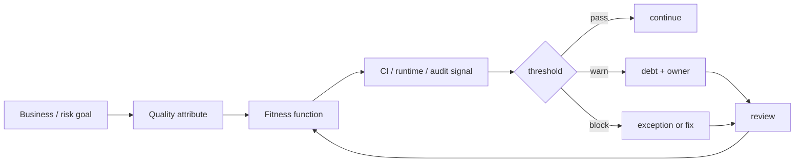

# Architectural Fitness Functions & Automated Governance

## Neden önemli?
Architecture review yalnız toplantı ve dokümana dayanırsa mimari ilkeler deploy hızından daha yavaş evrilir. Architectural fitness function, önemli bir kalite niteliğini veya constraint'i ölçülebilir ve mümkünse otomatik guardrail'e dönüştürür. Amaç her şeyi gate etmek değil; reliability, security, coupling, cost ve operability gibi kritik özelliklerin sistem değişirken sessizce bozulmasını erken görünür kılmaktır.

Evolutionary architecture bunu “guided, incremental change across multiple dimensions” fikriyle çerçeveler. İyi bir fitness function business outcome veya risk ile bağlantılıdır; signal, threshold, owner, consequence, exception ve review lifecycle'ı tanımlıdır.

## Mental model

**Temel invariant:** metric tek başına governance değildir; metric + threshold + owner + consequence + review loop governance oluşturur.

## İçeride ne oluyor?
- Atomic fitness function tek characteristic'i ölçebilir: dependency direction, API compatibility, secret leakage veya latency budget.
- Holistic fitness function birden çok component'in birlikte davranışını ölçer: end-to-end resilience, recovery veya cross-region failover.
- Static checks hızlı/deterministik olabilir; runtime/SLO checks gerçek davranışı yakalar fakat daha noisy ve pahalıdır.
- Binary pass/fail her risk için doğru değildir. Warning, error budget, progressive enforcement ve exception expiry gerekebilir.
- Guardrail sayısı büyüdükçe developer friction ve cargo-cult compliance riski artar; her function'ın owner ve business rationale'ı olmalıdır.
- Merkezi standart ile takım özerkliği arasında executable contract olarak kullanılabilir.

## Mülakat soruları
1. Unit/integration test ile architectural fitness function farkı nedir?
2. Hangi architectural characteristics otomatik ölçülebilir, hangileri judgment ister?
3. Senior: p99 latency fitness function'ını flaky CI gate olmadan nasıl tasarlarsın?
4. Staff: 100 microservice için coupling ve API compatibility guardrail'lerini nasıl ölçeklersin?
5. Principal: merkezi platform standardı ile takım özerkliğini nasıl dengelersin?
6. CTO: hangi guardrail deploy'u bloklamalı? Kararı business risk üzerinden açıkla.

## Beklenen cevap derinliği
- **Senior:** quality attribute'u measurable signal ve threshold'a çevirir; false positive/negative'i tartışır.
- **Staff:** portfolio-wide guardrail, exception workflow, ownership ve developer experience tasarlar.
- **Principal:** architectural drift, platform contracts, policy lifecycle ve cross-team migration yönetir.
- **CTO:** guardrail yatırımını reliability, security, compliance, cost ve delivery speed ile ekonomik olarak bağlar.

## Mini alıştırma
Bir ödeme platformu için availability, dependency coupling, backward-compatible API, secret leakage ve cloud cost üzerine beş fitness function yaz. Her biri için signal, threshold, enforcement (`warn/block/runtime alert`), owner ve exception TTL belirle. Hangilerinin CI yerine production telemetry ile ölçülmesi gerektiğini savun.

## Proje fikri
`architecture-guardrails`: dependency rule, OpenAPI breaking-change check, IaC policy, p99 performance budget ve cost-delta kontrolünü tek CI raporunda birleştir. Her kuralın owner, rationale, severity ve expiry metadata'sı olsun.

## Failure modes / trade-off / production
Vanity metric'i gate yapmak, her ihlali deploy blocker yapmak, noisy threshold, exception'ları süresiz bırakmak, ölçülebilir olanı önemli olanla karıştırmak ve guardrail'leri platform kullanıcılarından bağımsız tasarlamak tipik hatalardır. Production'da guardrail failure rate, override/exception sayısı ve yaşı, false-positive oranı, lead-time etkisi, escaped incidents ve architectural debt trend'i izlenmelidir.

## Kaynaklar
- Thoughtworks — Fitness function-driven development: https://www.thoughtworks.com/insights/articles/fitness-function-driven-development
- Building Evolutionary Architectures official site: https://evolutionaryarchitecture.com/
- AWS Architecture Blog — Using Cloud Fitness Functions to Drive Evolutionary Architecture: https://aws.amazon.com/blogs/architecture/using-cloud-fitness-functions-to-drive-evolutionary-architecture/
