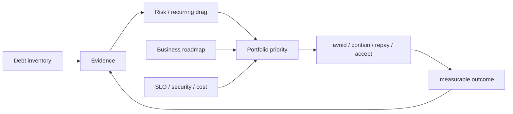

# Technical Debt Portfolio, Risk Pricing & Investment Governance

## Konu anlatımı
Technical debt yalnız çirkin kod değildir. Bugünkü teknik karar gelecekte change cost, incident probability, security exposure, cloud spend veya onboarding friction artırabilir. Metaforda principal mevcut yapısal yük, interest ise bu yük nedeniyle her değişiklikte tekrar ödenen ek maliyettir.

CTO seviyesinde debt tek tek refactor ticket'ı değil risk ve yatırım portföyüdür. Her item için exposure, likelihood, recurring drag, remediation cost ve option value düşünülür. Reliability debt SLO/error-budget, security debt exploitability/exposure, developer-productivity debt lead-time/rework, cost debt unit economics ile bağlanabilir.

Sabit “%20 debt zamanı” tek başına strateji değildir. Daha güçlü model: debt register + owner + evidence + risk class + trigger + target outcome. Yatırım ürün roadmap'i ve şirket risk appetite'ıyla birlikte kararlaştırılır.

## Mental model

Technical debt backlog değil balance sheet + risk register gibi düşünülür: hangi gelecekteki teslimat, nakit akışı veya risk profili değişecek?

## İçeride ne oluyor?
1. Incident, architecture review, security finding, delivery ve cost telemetry'den debt toplanır.
2. Reliability/security/velocity/cost/compliance sınıfı verilir.
3. Incident minutes, toil, cloud cost, dependency EOL gibi evidence eklenir.
4. Risk ve recurring drag yaklaşık boyutlandırılır; sahte hassasiyetten kaçınılır.
5. Repay, contain, gradual migrate, accept veya product surface retire seçenekleri karşılaştırılır.
6. Roadmap kapasitesi business outcome/risk appetite ile tahsis edilir.
7. Exit criterion belirlenir: lead time -%30, Sev-1 class kapanması, cost/request -%20 gibi.
8. Realized outcome ölçülür ve register güncellenir.

## Mülakat soruları
- Technical debt ile bug/feature request nasıl ayrılır?
- Senior: rewrite talebini nasıl değerlendirirsin?
- Staff: debt item'larını risk ve recurring drag ile nasıl sıralarsın?
- Principal: platform migration option value'su nasıl ölçülür?
- EM: feature delivery ile debt repayment kapasitesi nasıl müzakere edilir?
- CTO: board'a iki çeyrek platform yatırımını hangi business metric'lerle anlatırsın?
- Hangi debt bilinçli kabul edilmelidir?
- Incident sonrası remediation ile over-engineering sınırı nedir?

## Beklenen cevap seviyesi
**Senior:** local debt'i change cost/incident ile bağlar. **Staff:** dependency graph, sequence, ownership. **Principal:** systemic risk, standards, option value. **EM:** capacity/incentives/predictability. **CTO:** revenue, margin, regulation, reliability ve strategic optionality.

## Mini alıştırma
A: ayda 8 engineer-hour release toil. B: yılda yaklaşık bir kez 2 saat checkout outage riski. C: 9 ay sonra EOL olacak kritik dependency. Her biri için evidence, exposure, likelihood/drag, remediation cost, trigger ve success metric yaz. Tek scalar skor yerine karar gerekçesi üret.

## Proje
`debt-portfolio-dashboard`: owner, class, evidence, affected systems, risk band, recurring hours/month, remediation estimate, trigger/deadline, target metric ve decision log alanları olan küçük dashboard. Aylık accepted/contained/repaid review ve realized outcome takibi ekle.

## Failure modes / trade-off / production
Debt'i yalnız story-point backlog yapmak business exposure'u gizler. Tek debt score tail risk'i ezebilir. Rewrite bias incremental containment'i gölgeler. Yalnız kısa vadeli ROI security/compliance ve low-frequency/high-impact risk'i küçümseyebilir. Owner ve exit criterion olmayan platform programı sonsuz yatırıma dönüşebilir.

Debt register incident/postmortem, SLO/error-budget, vulnerability/EOL, CI/CD lead time, change failure, toil, cloud unit cost ve customer impact telemetry'sine bağlanmalıdır. Amaç sıfır debt değil, şirket stratejisine uygun bilinçli risk taşıma ve yatırım verimliliğidir.

## Kaynaklar
- Google SRE — Eliminating Toil: https://sre.google/sre-book/eliminating-toil/
- Google SRE — Embracing Risk: https://sre.google/sre-book/embracing-risk/
- Google SRE — Error Budget Policy: https://sre.google/workbook/error-budget-policy/
- Martin Fowler — Technical Debt Quadrant: https://martinfowler.com/bliki/TechnicalDebtQuadrant.html
