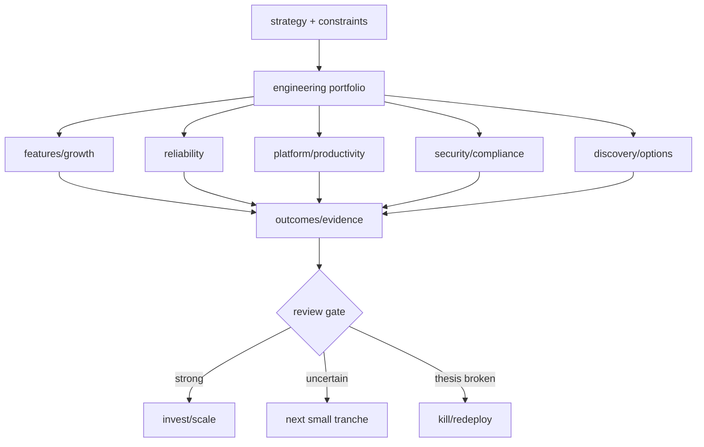

# Engineering Investment Portfolio, Options & Kill Criteria

**Seviye:** Senior → CTO  
**Alan:** Leadership / Product / Business

## Konu anlatımı
Engineering roadmap sınırlı kapasitenin farklı getiri ve risk profillerine dağıtıldığı bir yatırım portföyü olarak ele alınabilir. Feature işi growth/revenue opsiyonu; reliability expected-loss reduction; platform future lead-time/leverage; security/compliance tail-risk reduction; discovery ise belirsizliği azaltan option value üretir.

Tek priority score karar sistemi değildir. RICE/WSJF benzeri skorlar tartışmayı yapılandırabilir fakat dependencies, correlated risk, tail events, reversibility ve capacity coupling'i tek sayıda gizleyebilir. CTO seviyesinde portfolio şirket stratejisi, runway, reliability/security obligations ve organizational capability ile birlikte yönetilir.

## Mental model

## Decision system
1. Strategy ve non-negotiable constraints'i tanımla.
2. Work item'i output değil measurable outcome hypothesis olarak yaz.
3. Expected upside, downside/tail risk, confidence, time-to-information, reversibility ve dependencies kaydet.
4. Portfolio category guardrail'ları reliability/security/platform kapasitesinin sürekli feature pressure tarafından yenmesini engellesin.
5. Belirsiz bet'leri tranche'lara böl; her tranche bilgi veya risk reduction üretmeli.
6. Review gate'te sunk cost değil forward-looking expected value değerlendir.
7. Önceden tanımlı kill/continue/scale kriterleriyle capacity'yi yeniden tahsis et.

## Mülakat soruları
1. Roadmap neden feature backlog'u değildir?
2. Reliability ROI'si feature ROI'siyle nasıl karşılaştırılır?
3. Reversible ve irreversible bet farkı nedir?
4. Platform yatırımında leading indicator nedir?
5. Kill criteria neden başta tanımlanmalıdır?
6. Staff/Principal: platform migration ve customer dependency nasıl sequence edilir?
7. EM/Director: interrupt-heavy organizasyonda capacity guardrail nasıl kurulur?
8. CTO: runway daralırken portfolio allocation hangi sinyallerle değişir?

## Beklenen cevap seviyesi
- **Senior:** outcome, opportunity cost, dependency, reversibility.
- **Staff/Principal:** cross-team leverage, platform adoption, technical-risk reduction.
- **EM/Director:** WIP, capacity allocation, review cadence, predictability.
- **CTO:** strategy, runway, margin, regulatory/tail risk, capability building.

## Mini alıştırma
100 engineer-week'i checkout conversion, DB failover reliability, developer platform ve compliance automation arasında dağıt. Her bet için outcome, confidence, downside, time-to-information ve kill criterion yaz. Runway 18 aydan 8 aya inince allocation'ı yeniden değerlendir.

## Proje
`engineering-portfolio-review`: 12 initiative için hypothesis, category, capacity, confidence, reversibility, leading metric, review date ve kill/scale criterion içeren decision register oluştur. Aylık evidence ile allocation'ı değiştir ve karar geçmişini log'la.

## Failure modes / trade-off / production bağlantısı
- Tek score: false precision.
- Platform vanity metrics: gerçek lead-time/reliability leverage görünmez.
- Reliability/security'nin sürekli ertelenmesi: nonlinear tail risk.
- Çok fazla strategic initiative: WIP/context switching.
- Kill criterion yokluğu: sunk-cost/prestige continuation.

Portfolio health için WIP, cycle time, error-budget/incident trendi, security exposure age, platform adoption + lead-time etkisi, hypothesis hit-rate, capacity drift ve cost-to-serve birlikte izlenmelidir.

## Kaynaklar
- Google SRE Book — Embracing Risk: https://sre.google/sre-book/embracing-risk/
- Google SRE Workbook — Error Budget Policy: https://sre.google/workbook/error-budget-policy/
- AWS Well-Architected — Cost Optimization Pillar: https://docs.aws.amazon.com/wellarchitected/latest/cost-optimization-pillar/welcome.html
- FinOps Framework: https://www.finops.org/framework/
