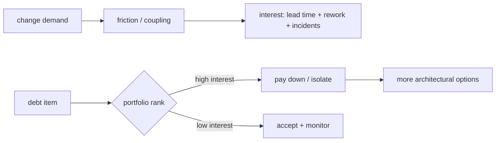

# Technical Debt Portfolio Economics & Architecture Runway

## Mental model

## Debt'i ekonomik modellemek
Technical debt'i yalnız code smell backlog'u olarak görmek önceliklendirmeyi bozar. Debt'in **principal**'ı kabaca düzeltme/migration maliyetidir; **interest** ise debt yüzünden gelecekte tekrar tekrar ödenen ek change, coordination, incident ve operational maliyettir. Kısa vadeli bilinçli debt time-to-market satın alabilir; sorun owner, repayment trigger ve gözlenebilir interest olmadan kalıcı hale gelmesidir.

Yüksek change frequency + yüksek coupling + yüksek business criticality bölgeleri genellikle daha yüksek faiz üretir. Bu nedenle debt portfolio ranking için change hotspot, blast radius, dependency count, incident history, rework ve strategic roadmap birlikte okunmalıdır.

## Architecture runway
Architecture runway, aylarca feature delivery'yi durdurup geleceği tahmin eden büyük platform/rewrite programı değildir. Yakın ürün stratejisinin gerektireceği değişiklikleri daha ucuz ve güvenli kılan küçük enabling investment'lar bütünüdür. Compatibility layer, strangler migration, contract boundary, deployment independence veya testability yatırımı bunun parçası olabilir.

Rewrite en yüksek-riskli repayment seçeneklerinden biridir: parity gap, hidden behavior, dual-run cost ve migration tail yaratır. Incremental isolation çoğu zaman opsiyon değerini korur ve geri dönüş noktaları sağlar.

## Ölçüm ve karar
Debt repayment bir engineering output değil, hypothesis olmalıdır: "bu boundary'yi ayırırsak change lead time ve cross-team coordination azalacak." Intervention öncesi baseline, sonrası outcome ölçülür. DORA'nın güncel delivery modelinde throughput ile instability ayrı sinyallerdir; tek velocity metriğiyle debt kararları verilmemelidir.

## Mülakat soruları
1. Technical debt ile bug/kötü kod farkını nasıl düşünürsün?
2. Debt interest nasıl ölçülür?
3. Rewrite ne zaman yanlış seçimdir?
4. Architecture runway ile over-engineering nasıl ayrılır?
5. Senior: yüksek-change hotspot'ta ilk refactoring nasıl seçilir?
6. Staff: cross-team debt'in owner/migration planı nasıl kurulur?
7. Principal: debt portfolio feature roadmap ile nasıl karşılaştırılır?
8. CTO: altı aylık rewrite talebinden hangi ekonomik ve risk kanıtlarını beklersin?

## Seviye beklentisi
**Senior:** hotspot, coupling, rework, incremental refactoring. **Staff:** cross-team dependency ve migration sequencing. **Principal:** portfolio ranking ve architectural optionality. **CTO:** opportunity cost, capital allocation, product strategy, risk ve time-to-market.

## Mini alıştırma / proje
Üç debt item'ı `change frequency × coupling × incident impact` proxy'siyle sırala; principal, aylık interest ve pay/isolate/accept kararı ver. Portföy projesi olarak git change frequency, ownership, incident ve deployment/rework telemetry'sinden hotspot radar üret; skorun otomatik karar değil evidence olduğunu koru.

## Failure modes / production
Debt'i LOC/code-smell sayısına indirgemek, rewrite'ı default çözüm yapmak, product outcome'dan kopuk platform programı yürütmek, debt metric'ini bireysel performansa bağlamak ve repayment sonrası sonucu ölçmemek başlıca failure mode'lardır. Lead time, deployment rework, change fail rate, recovery time, incident concentration ve team dependency sayısı birlikte okunur.

## Kaynaklar
- DORA — Continuous Delivery: https://dora.dev/capabilities/continuous-delivery/
- DORA — Loosely Coupled Teams: https://dora.dev/capabilities/loosely-coupled-teams/
- DORA — Software delivery metrics history: https://dora.dev/insights/dora-metrics-history/
- Martin Fowler — Technical Debt Quadrant: https://martinfowler.com/bliki/TechnicalDebtQuadrant.html
