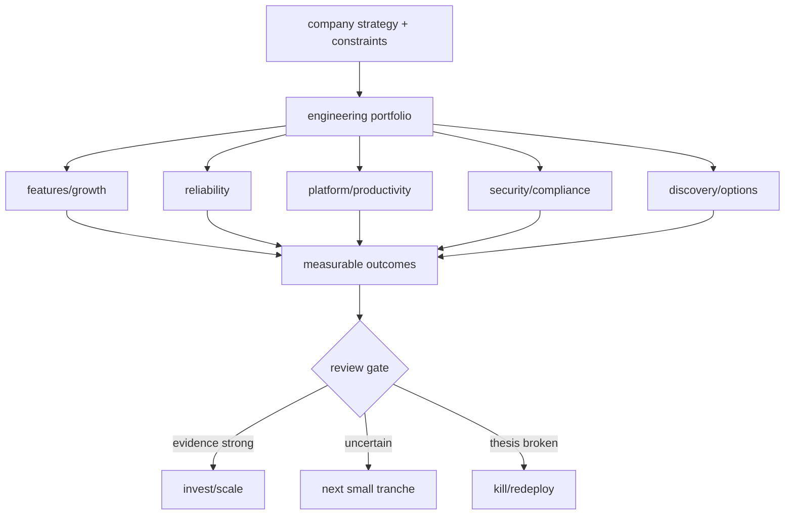

# Engineering Investment Portfolio, Options & Kill Criteria

**Seviye:** Senior → CTO  
**Alan:** Leadership / Product / Business

## Temel fikir
Engineering roadmap yalnız feature listesi değildir; sınırlı insan ve sermaye kapasitesinin farklı getiri/risk profillerine dağıtıldığı bir yatırım portföyüdür. Feature işi growth/revenue opsiyonu; reliability expected-loss reduction; platform future lead-time reduction; security/compliance tail-risk reduction; discovery/spike ise belirsizliği azaltan option value üretebilir.

Tek bir priority score tartışmayı yapılandırabilir fakat correlation, dependency, tail risk, reversibility ve capacity coupling'i gizleyebilir. CTO seviyesinde amaç en yüksek skoru seçmek değil; strategy, runway, reliability/security obligations ve reversible/irreversible bets altında dengeli portfolio kurmaktır.

## Decision system
1. Strategy, planning horizon ve non-negotiable constraints açıklaştırılır.
2. Initiative output değil measurable outcome hypothesis olarak yazılır.
3. Expected upside, downside/tail risk, confidence, time-to-information, reversibility ve dependencies kaydedilir.
4. Portfolio guardrail'ları urgent feature işinin reliability/security/platform kapasitesini sürekli tüketmesini engeller.
5. Büyük belirsiz bets küçük tranche'lara bölünür; her tranche bilgi veya risk reduction üretmelidir.
6. Review gate sunk cost'a değil forward-looking expected value'ya bakar.
7. Thesis bozulduğunda capacity yeniden tahsis edilir.

## Kill criteria ve option value
Kill/continue/scale kriteri işe başlamadan önce belirlenirse sunk-cost etkisi azalır. Reversible bet küçük tranche ile denenebilir; irreversible migration/regulatory commitment daha güçlü evidence ve downside analysis ister. Bir discovery bet'i ürünleşmese bile ucuz ve karar değiştirici bilgi ürettiyse değer yaratmış olabilir.

## Mülakat soruları
1. Engineering roadmap neden feature backlog'u gibi yönetilmemeli?
2. Reliability ROI'sini revenue feature ile nasıl karşılaştırırsın?
3. Reversible ve irreversible technical bet farkı nedir?
4. Platform investment için leading indicator nedir?
5. Kill criteria neden önceden tanımlanmalıdır?
6. Staff/Principal: platform migration ile customer-feature dependency'sini nasıl sequence edersin?
7. EM/Director: sürekli interrupts için hangi capacity guardrail'larını kurarsın?
8. CTO: runway kısalırken allocation'ı hangi sinyallerle değiştirirsin?

## Beklenen cevap derinliği
- **Senior:** outcome, dependency, opportunity cost ve reversibility dilini kullanır.
- **Staff/Principal:** cross-team leverage, adoption ve technical-risk reduction'ı ölçer.
- **EM/Director:** capacity allocation, review cadence ve predictability'yi yönetir.
- **CTO:** portfolio'yu runway, gross margin, regulatory/tail risk ve organizational capability ile bağlar.

## Alıştırma
100 engineer-week'i checkout conversion, database failover, developer platform ve compliance automation arasında dağıt. Her biri için expected outcome, confidence, downside, time-to-information ve kill criterion yaz. Runway 18 aydan 8 aya düşünce allocation'ı yeniden yap.

## Proje fikri
`engineering-portfolio-review`: 12 initiative için hypothesis, category, capacity, confidence, reversibility, leading metric, review date ve kill/scale criterion tutan decision register oluştur. Aylık evidence ile capacity'yi yeniden tahsis et ve değişiklikleri ADR benzeri log'la kaydet.

## Failure modes / trade-off / production
Tek score false precision üretir. Platform ROI'sini yalnız adoption ile ölçmek lead-time/reliability etkisini kaçırır. Reliability/security'yi sürekli ertelemek nonlinear tail risk biriktirir. Fazla WIP context switching yaratır. Kill criterion olmadan prestige/sunk-cost yatırımları sürer. WIP, cycle time, error-budget/incident trendi, security exposure age, platform adoption + lead-time etkisi, hypothesis hit-rate, capacity drift ve cost-to-serve birlikte izlenmelidir.

## Kaynaklar
- Google SRE Book — Embracing Risk: https://sre.google/sre-book/embracing-risk/
- Google SRE Workbook — Error Budget Policy: https://sre.google/workbook/error-budget-policy/
- AWS Well-Architected — Cost Optimization: https://docs.aws.amazon.com/wellarchitected/latest/cost-optimization-pillar/welcome.html
- FinOps Framework: https://www.finops.org/framework/
