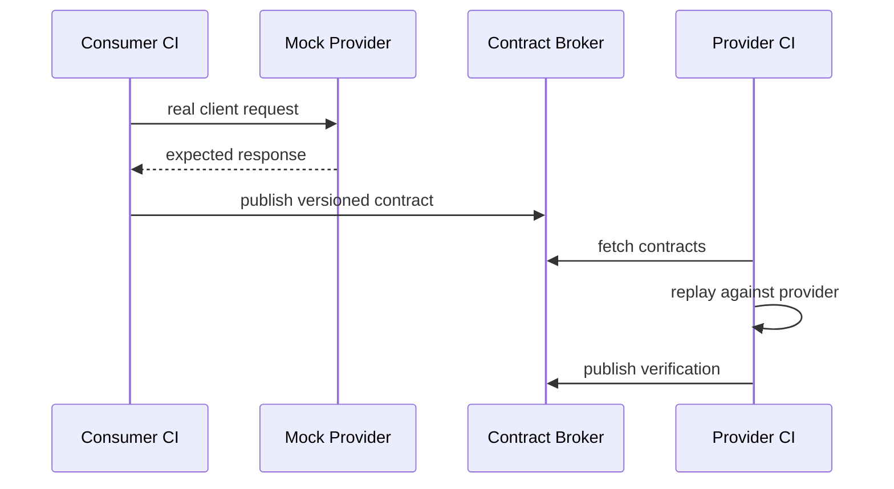

# Consumer-Driven Contract Testing & Safe API Evolution

## Mental model
Schema “hangi mesajlar biçimsel olarak geçerli olabilir?” sorusunu; consumer-driven contract ise “bu consumer gerçekte hangi interaction'a güveniyor ve provider bunu hâlâ karşılıyor mu?” sorusunu cevaplar.

## Temel mekanizma
Pact gibi CDC araçlarında consumer gerçek API client kodunu mock provider'a karşı çalıştırır ve kullandığı interaction'lardan executable contract üretir. Provider CI contract'ı gerçek provider implementation'a replay ederek doğrular. Broker contract ve verification sonuçlarını versiyonlar; release pipeline consumer/provider sürümlerinin uyumluluk kanıtını kullanabilir.

OpenAPI gibi schema/specification ile CDC tamamlayıcıdır. Schema geniş API yüzeyini tarif eder; CDC gerçek consumer'ın kullandığı status, header, payload subset ve provider-state beklentisini executable örnekle korur. Contract'ı gereksiz exact match etmek güvenli provider değişikliklerini engeller; consumer'ın kullanmadığı response alanları mümkün olduğunca contract'ı sıkılaştırmamalıdır.

## Mülakat soruları
- Contract test ile E2E integration test farkı nedir?
- Schema validation neden tek başına CDC'nin yerini tutmaz?
- Consumer neden yalnızca kullandığı response alanlarını contract'a koymalıdır?
- Provider state neden determinism için önemlidir?
- Eski mobile client sürümlerinde compatibility gate nasıl tasarlanır?
- Yüzlerce service için ownership/versioning nasıl yönetilir?

## Seviyeye göre derinlik
- **Mid:** consumer/provider, executable contract, provider verification.
- **Senior:** loose matching, provider states, versioning, async messages, schema-vs-behavior.
- **Staff:** broker governance, deployment gates, multi-version consumers ve ownership.

## Mini alıştırma
Mobile consumer `GET /users/{id}` cevabından `id`, `name`, `status` kullanıyor. Provider `last_login` ekliyor, status enum'unu genişletiyor ve name'i nullable yapıyor. Her değişikliği consumer davranışına göre compatibility açısından analiz et.

## Proje
`contract-evolution-lab`: iki küçük service kur. Consumer contract üretip provider CI'da verify et. Additive field, field removal, enum expansion ve type change yap; schema-diff ile CDC sonucunu karşılaştır.

## Failure modes / trade-off / production
UI/business logic'i contract test içine taşımak interaction patlaması yaratır. Exact matching provider'ı gereksiz kilitler. Verification geçse bile auth, network, timeout, migration ve multi-service workflow bug'ları kalabilir; E2E tamamen ortadan kalkmaz. Eski mobile/desktop sürümleri compatibility window'u uzatır. Production'da verification sonucu, deployed version graph, consumer usage telemetry ve deprecation policy birlikte yönetilmelidir.

## Kaynaklar
- Pact Introduction: https://docs.pact.io/
- Pact Consumer Tests: https://docs.pact.io/consumer
- Pact Provider Verification: https://docs.pact.io/getting_started/verifying_pacts
- OpenAPI Specification: https://spec.openapis.org/oas/
