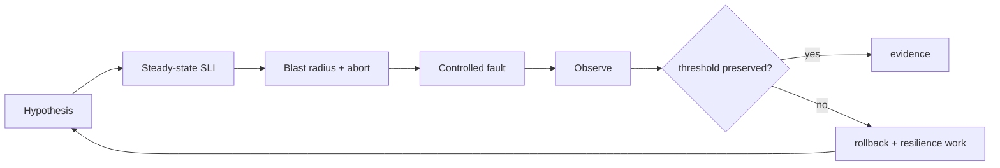

# Fault Injection, Chaos Experiments & Steady-State Validation

**Seviye:** Mid → CTO

## Konu anlatımı
Fault injection belirli failure mode'u kontrollü tetikler: dependency timeout, packet loss, process kill, disk-full veya zone loss. Chaos experiment ise falsifiable resilience hipotezini sınar: fault altında kullanıcıya görünen steady-state ölçütü kabul sınırında kalacak mı?

Güçlü deney “servisi boz ve bak” değildir. Önce SLI/eşik, blast radius ve abort condition tanımlanır; sonra fault uygulanır ve teknik + kullanıcı etkisi ölçülür. Deterministic unit/integration testler correctness tabanıdır; fault injection failure-path coverage, production-benzeri chaos ise dağıtık emergent behavior ve recovery varsayımlarını sınar.

## Mental model
Chaos = rastgele kırmak değil kontrollü hipotez testi. Safety'nin temeli blast-radius ve abort kontrolüdür.

## İçeride ne oluyor?
1. Kritik user journey ve SLI seçilir.
2. Fault modeli incident/architecture riskinden türetilir.
3. Scope instance/cell/tenant/canary ile sınırlandırılır.
4. Abort ve rollback önceden doğrulanır.
5. Fault enjekte edilir; latency/error/saturation ve business signal ölçülür.
6. Retry, queue, breaker, failover, autoscaling davranışı gözlenir.
7. Bulgular runbook/alert/backlog/regression testine dönüşür.

## Mülakat soruları
- Fault injection ile chaos experiment farkı nedir?
- Steady-state metriği neden önceden tanımlanır?
- Dependency timeout deneyinde ne ölçersin?
- Retry storm nasıl yakalanır?
- Staff: blast radius ve kill switch nasıl tasarlanır?
- Principal/CTO: chaos yatırımının ROI'sini nasıl değerlendirirsin?

## Beklenen cevap seviyesi
- **Mid:** fault, hypothesis, metric, rollback.
- **Senior:** timeout/retry/breaker, saturation, recovery.
- **Staff:** cell/canary isolation, platform, governance.
- **Principal/CTO:** risk portfolio, customer impact budget, compliance ve ROI.

## Mini alıştırma
Payment dependency'sine 2 saniye latency fault'u için hipotez, SLI, blast radius, abort threshold ve fallback yaz; retry=3 amplification riskini düzelt.

## Proje fikri
Küçük API + dependency kur; Toxiproxy veya fault shim ile latency/timeout/reset enjekte et. Retry/backoff/breaker kombinasyonlarında p95/p99, error rate ve request amplification ölç.

## Failure modes / trade-off / production
Belirsiz hipotez gürültü, büyük blast radius outage yaratır. Kill switch aynı failure domain'indeyse rollback çalışmayabilir. Retry downstream yükünü katlayabilir. Staging traffic shape'i temsil etmeyebilir; production güçlü guardrail ister. Başarı metriği user SLI + recovery time + amplification olmalıdır.

## Kaynaklar
- https://principlesofchaos.org/
- https://sre.google/sre-book/testing-reliability/
- https://docs.aws.amazon.com/fis/
- https://kubernetes.io/docs/concepts/workloads/pods/disruptions/
