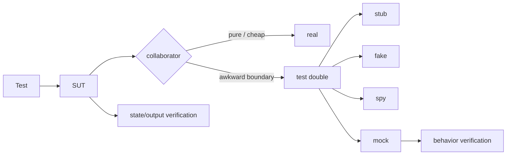

# Test Doubles, State vs Behavior Verification ve Mock Boundaries

## Temel fikir
Test double, production collaborator yerine testte kullanılan kontrollü nesne için genel terimdir. Amaç her şeyi mock'lamak değil; controllability, fidelity ve coupling arasında doğru sınırı seçmektir.

## Vocabulary
- **Dummy:** taşınır fakat test davranışında kullanılmaz.
- **Fake:** çalışan fakat production için uygun olmayan basitleştirilmiş implementation; ör. in-memory repository.
- **Stub:** belirli çağrılara canned answer verir.
- **Spy:** stub davranışına ek olarak çağrı bilgisini kaydeder.
- **Mock:** beklenen interaction'ları önceden tanımlar ve behavior verification yapar.

## State vs behavior verification
State verification observable output/state'i doğrular. Behavior verification collaborator ile belirli interaction'ın gerçekleşmesini doğrular. Interaction gerçekten contract'ın parçasıysa behavior verification değerlidir; internal method-call sequence'i contract gibi test etmek ise refactor friction üretir.

## Boundary seçimi
Real collaborator pure, deterministic ve cheap ise double gerekmeyebilir. Network, clock, randomness, mail/payment gateway veya destructive side effect gibi sınırlar controllable double için iyi adaydır. Ancak fake production semantics'ten drift edebilir; bu nedenle contract/integration testleri gerçek dependency davranışıyla bağlantıyı korumalıdır.

## Hermetic test düşüncesi
Hermetic test sonucu internet, wall clock, global mutable state veya paylaşılan service durumundan kontrolsüz etkilenmez. Clock injection, seeded randomness, local fake ve isolated fixture reproducibility sağlar. Hermetic olmak fidelity'nin otomatik olarak yüksek olduğu anlamına gelmez.

## Mülakat soruları
- Stub, fake, spy ve mock farkları nedir?
- State ve behavior verification ne zaman ayrışır?
- Over-mocking neden brittle tests üretir?
- In-memory DB fake'i production DB'den hangi noktalarda sapabilir?
- Payment provider için unit/contract/integration/E2E test portfolio'su nasıl kurulur?
- Clock ve retry/backoff deterministic nasıl test edilir?

## Failure modes / trade-off
- Over-mocking implementation detail coupling yaratır.
- Çok fazla real dependency suite'i yavaş ve flaky yapar.
- Fake semantic drift false confidence üretir.
- Mock yalnız happy-path protocolünü temsil edebilir.
- Her test katmanını aynı şeyi tekrar doğrulatmak bakım maliyetini artırır.

## Production bağlantısı
Incident'ten çıkan edge case'i yalnız unit stub'a değil gerekiyorsa fake ve gerçek contract/integration testine de geri besle. Flaky-test rate, suite latency ve escaped integration defects test architecture için operasyonel sinyallerdir.

## Mini lab
`CheckoutService -> Inventory -> Payment -> Email` için her dependency'de real/fake/stub/mock seçimini gerekçelendir. Internal refactor sonrası hangi assertion'ların aynı kalması gerektiğini belirle. Payment fake'inde kasıtlı semantic drift oluştur ve contract testinin bunu yakaladığını göster.

## Kaynaklar
- Martin Fowler — Test Double: https://martinfowler.com/bliki/TestDouble.html
- Martin Fowler — Mocks Aren't Stubs: https://martinfowler.com/articles/mocksArentStubs.html
- Google Testing Blog: https://testing.googleblog.com/
