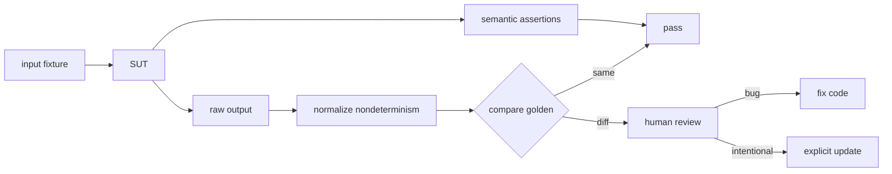

# Golden/Snapshot Tests, Normalization & Reviewable Oracles

## Neden önemli?
Golden veya snapshot test, karmaşık output'u version-controlled expected artifact ile karşılaştıran regression oracle'dır. Compiler diagnostics, generated code, CLI output, serializer sonuçları ve büyük structured representation'larda çok sayıda küçük assertion yerine okunabilir diff sağlayabilir.

Snapshot kendi başına doğruluğu bilmez. Baseline yanlış olabilir; developer update komutunu düşünmeden çalıştırırsa bug yeni expected output'a dönüşebilir. Bu nedenle snapshot'ın gücü **reviewable oracle** olmasından gelir: deterministic output, küçük diff, explicit update ve semantic invariant'larla desteklenmiş review.

## Mental model
Golden file **kaydedilmiş gerçek değil, version-controlled oracle**'dır. Kaliteyi snapshot sayısı değil, yanlış davranışı reddetme gücü ve diff'in review edilebilirliği belirler.

## Normalization
Timestamp, UUID, temp path, address veya unstable map ordering snapshot churn üretebilir. Contract açısından anlamsız nondeterminism canonicalize edilebilir. Fakat normalization gerçek regression'ı saklayabilir: kullanıcıya gösterilen error code, authorization decision veya money amount gibi semantic alanları wildcard yapmak oracle'ı zayıflatır.

## Full snapshot mı targeted check mi?
Byte-for-byte golden, output'un tamamı gerçekten contract olduğunda güçlüdür. Büyük output'ta yalnız belirli pattern veya invariants önemliyse targeted assertions daha reviewable olabilir. Compiler testing bunun iyi örneğidir: LLVM `lit` küçük regression tests yürütür; `FileCheck` textual output'ta ilgili pattern'leri doğrulamaya izin verir. Golden ve semantic assertion birbirinin alternatifi değildir.

## İçeride ne oluyor?
1. Stable fixture input üretir.
2. SUT output üretir.
3. Yalnız nondeterministic/irrelevant alanlar normalize edilir.
4. Actual committed expected artifact ile karşılaştırılır.
5. Diff failure artifact'i olur.
6. Intentional değişiklik explicit update ile golden'a taşınır ve code review'da incelenir.
7. Critical semantics targeted assertions/properties ile ayrıca korunur.

## Mülakat soruları
- Golden/snapshot test ne zaman çok sayıda assertion'dan daha uygundur?
- Snapshot neden regression testidir ama tek başına specification değildir?
- Timestamp/UUID nondeterminism'i nasıl ele alırsın?
- Snapshot update workflow'u nasıl false confidence yaratır?
- Pattern/semantic assertion ne zaman full snapshot'tan iyidir?
- Büyük compiler/codegen reposunda snapshot churn ve CI cost nasıl yönetilir?

## Beklenen cevap seviyesi
- **Junior:** fixture → actual → expected diff akışını açıklar.
- **Mid:** determinism, normalization ve explicit update workflow'u kurar.
- **Senior:** oracle strength, over-broad snapshots ve semantic assertions konuşur.
- **Staff:** sharding, changed-area selection, artifact retention, flaky/churn metrics ve ownership tasarlar.

## Mini alıştırma
Bir CLI output'unda request ID, timestamp, unordered map ve user-visible error code var. Hangilerini normalize edeceğini seç; error code'u neden koruman gerektiğini açıkla. Sonra full snapshot ile üç targeted semantic assertion yaklaşımını karşılaştır.

## Proje fikri
`golden-oracle-lab`: küçük parser/code-generator yaz. 15 fixture için committed golden outputs üret ve explicit update flag ekle. Path/timestamp normalization uygula. Intentional syntax değişikliği ve accidental error-message regression'ı oluştur; diff kalitesini karşılaştır ve kritik invariants için ek assertions yaz.

## Failure modes / trade-off / production
Devasa snapshot'lar rubber-stamp review'a dönüşebilir. Otomatik toplu update bug'ı baseline'a gömebilir. Locale/newline/path farkları flaky test yaratabilir. Aşırı normalization signal'ı silebilir. Production incident'inden çıkan user-visible regression minimal fixture + semantic assertion + gerekiyorsa golden artifact olarak suite'e geri beslenmelidir. Snapshot churn, flaky rate, diff size ve review ownership test sağlığı sinyalleridir.

## Kaynaklar
- LLVM — Testing Infrastructure Guide: https://llvm.org/docs/TestingGuide.html
- LLVM — FileCheck: https://llvm.org/docs/CommandGuide/FileCheck.html
- Go — testing package: https://pkg.go.dev/testing
