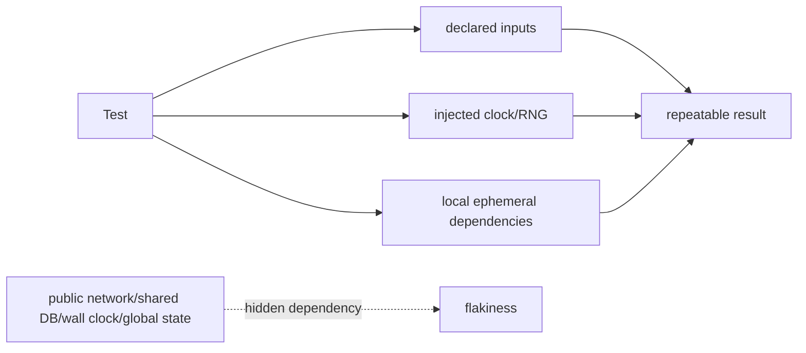

# Hermetic Tests, Test Sizes & Deterministic Boundaries

## Neden önemli?
Flaky test yalnız “CI bazen bozuluyor” problemi değildir; debugging süresini, developer trust'ını, parallel execution'ı ve release güvenini aşındırır. Hermeticity testin sonucunu açıkça declared input/dependency'lere bağlayarak hidden environment etkisini küçültür.

## Mental model

Hermeticity = **testin dünyasını küçült ve sınırlarını ilan et**. Test size ise bu dünyanın ne kadar kaynak ve dış bağımlılık kullanabileceğini tanımlayan execution contract'ıdır.

## Hermetic test nedir?
Hermetic test developer laptop'ındaki timezone, `$HOME`, shared staging database, public HTTP endpoint, başka testin bıraktığı state veya gerçek wall-clock timing gibi gizli dependency'lere dayanmaz. Aynı source + declared inputs + controlled runner environment ile tekrar üretilebilir davranış hedeflenir.

Hermetic olmak “her şeyi mock'lamak” değildir. Gerçek database semantics kritikse disposable local database/container daha doğru oracle olabilir. External dependency'nin protocol contract'ı önemliyse local protocol-faithful fake/server kullanılabilir. Kritik karar dependency fidelity ile determinism/cost arasında bilinçli sınır kurmaktır.

## Test size bir execution contract'ı olarak
Google'ın Small/Medium/Large yaklaşımı testleri yalnız “unit/integration/E2E” isimleriyle değil izin verilen resource davranışıyla sınıflandırır. Small test dış network/database/filesystem gibi kaynakları kullanmaz; medium localhost ve daha geniş process/thread/resource kullanımına izin verebilir; large external systems'e kadar çıkabilir. Bazel Test Encyclopedia da hermetic testlerin yalnız declared dependency'lere erişmesini hedefler.

Bu sınıflandırma CI'a somut policy verir: timeout, shard, cache, runner size, retry ve scheduling farklılaştırılabilir.

## Deterministic boundary tasarımı
- Clock inject et; `sleep()` ile zamanın geçmesini beklemek yerine fake/manual clock ilerlet.
- RNG için seed veya injectable generator kullan; failure seed'ini artifact olarak sakla.
- Fixed port yerine OS-assigned dynamic port kullan.
- Temp files için runner'ın isolated temp directory'sini kullan.
- Locale/timezone/environment değişkenlerini explicit yap.
- Shared DB/schema/account yerine unique namespace ve disposable fixture kullan.
- Test order'a güvenme; setup/teardown her testin kendi state'ini yönetmeli.
- External network yerine mümkün olduğunda local ephemeral dependency kullan.

## Mülakat soruları
1. Hermetic test nedir; deterministic test ile ilişkisi nedir?
2. Wall clock ve `sleep()` neden flaky test kaynağıdır?
3. Gerçek PostgreSQL semantics'ini test ederken hermeticity nasıl korunur?
4. Localhost ephemeral service neden shared staging endpoint'ten daha güvenilirdir?
5. Her dependency'yi mock'lamak neden yanlış olabilir?
6. Test size sınıfları CI scheduling/sharding policy'sini nasıl etkiler?
7. Retry ve quarantine ne zaman root cause'u gizler?

## Seviyeye göre cevap derinliği
- **Mid:** hidden dependency, fixture isolation, clock/network/state nondeterminism.
- **Senior:** ephemeral real dependency, fake-vs-real fidelity, parallelism, seed/reproduction, cleanup.
- **Staff:** suite taxonomy, sharding/cache, quarantine governance, ownership ve flaky-rate SLO.

## Mini alıştırma
Bir test `sleep(2)`, sabit `localhost:5432`, local timezone ve shared `test_db` kullanıyor. Her hidden dependency/collision kaynağını belirle. Fake clock, ephemeral DB, dynamic port ve explicit timezone ile yeni tasarım çiz; small mı medium mı olacağını gerekçelendir.

## Proje fikri
Aynı küçük API için iki suite kur: biri wall clock + shared DB + fixed port; diğeri injected clock + disposable DB + dynamic port + isolated temp directory. Her suite'i 100 kez parallel çalıştır; flaky rate, runtime distribution ve failure reproducibility'yi karşılaştır. CI'da size label ve ayrı timeout/shard policy uygula.

## Failure modes / production
Aşırı mocking gerçek DB/protocol semantics hatalarını kaçırabilir. Aşırı E2E test yavaş ve flaky feedback loop yaratır. Retry başarısız testleri “yeşile boyayabilir”. Shared account/data parallelism'i bozar. Production incident'lerinden çıkan contract mümkün olan en küçük güvenilir hermetic katmana indirgenmelidir. CI'da p50/p95 runtime, flaky rate, retry-pass oranı, quarantine yaşı ve size dağılımı izlenmelidir.

## Kaynaklar
- Bazel — Test Encyclopedia: https://bazel.build/reference/test-encyclopedia
- Google Testing Blog — Test Sizes: https://testing.googleblog.com/2010/12/test-sizes.html
- Google Testing Blog — Hermetic Servers: https://testing.googleblog.com/2012/10/hermetic-servers.html
- Google Testing Blog — Test Flakiness: https://testing.googleblog.com/2020/12/test-flakiness-one-of-main-challenges.html
