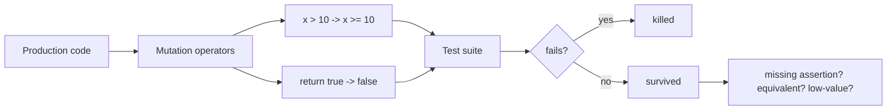

# Mutation Testing, Test Sensitivity & Surviving Mutants

## Konu anlatımı
Code coverage bir satırın test sırasında çalıştırıldığını gösterebilir; testin yanlış davranışı yakalayacağını garanti etmez. **Mutation testing**, production code'a kontrollü küçük değişiklikler uygulayıp test suite'in bunları fark edip etmediğini ölçer. Örnek mutation'lar `>` → `>=`, `true` → `false`, arithmetic operator veya return value değişimidir.

Test failure üretirse mutant **killed**, testler geçerse **survived** olur. Surviving mutant missing assertion/boundary test gösterebilir; ancak observable behavior'ı değiştirmeyen **equivalent mutant** da olabilir. Mutation score bu nedenle kör KPI değil, test oracle/sensitivity sinyalidir.

## Mental model

## İçeride ne oluyor?
1. Engine candidate code locations seçer.
2. Mutation operator küçük bir semantic değişiklik uygular.
3. İlgili testler mutant üzerinde çalıştırılır.
4. Failure mutantı killed; testlerin geçmesi survived yapar.
5. Coverage/test-impact bilgisi çalıştırılacak testleri daraltıp maliyeti azaltabilir.
6. Equivalent mutant observable behavior'ı değiştirmediği için öldürülemez.
7. Hang/timeout üreten mutantlar ayrıca sınıflandırılmalıdır.
8. CI'da kritik modül, changed-code veya periyodik mutation job tüm repo çalıştırmaktan ekonomik olabilir.

## Mülakat soruları
1. %100 line coverage neden güçlü test suite garantisi değildir?
2. Mutation testing neyi ölçer?
3. Surviving mutant her zaman eksik test midir?
4. Equivalent mutant nedir?
5. Mutation score'u KPI yapmanın riski nedir?
6. Senior: mutation testing maliyetini nasıl azaltırsın?
7. Staff: payment/authorization engine için mutation policy nasıl kurulur?
8. Flaky tests mutation sinyalini nasıl bozar?

## Beklenen cevap seviyesi
- **Junior:** coverage ile assertion strength farkını bilir.
- **Mid:** killed/survived/equivalent ve boundary-test ilişkisini açıklar.
- **Senior:** operator seçimi, test-impact analysis, timeout ve CI cost'u tartışır.
- **Staff:** risk-based scope, governance, flaky-test hygiene ve critical invariants ile bağ kurar.

## Mini alıştırma
`isEligible(age) = age >= 18` için yalnız `age=20` testi varken `>=` → `>` mutantının yaşayacağını göster. 17/18/19 boundary testlerini ekle. Ardından `price * 0.9` → `price * 1.0` mutantını öldürecek assertion yaz.

## Proje fikri
`mutation-gate-lab`: pricing/permissions/rate-limit policy içeren küçük domain library kur. Coverage ile mutation score'u yan yana raporla. Surviving mutantları `missing-test`, `equivalent`, `low-value` diye triage et; yalnız kritik package için CI gate uygula.

## Failure modes / trade-off / production
Mutation suite pahalıdır; düşük değerli operator'lar gürültü üretir. Score gaming anlamsız assertion'ları teşvik edebilir. Flaky testler sonuçları güvenilmez yapar. Money movement, authorization, parser/compiler, validation ve safety-critical decision logic gibi küçük kritik çekirdeklerde ise mutation testing yüksek getirili olabilir.

## Kaynaklar
- PIT Mutation Testing: https://pitest.org/
- PIT Mutation Operators: https://pitest.org/quickstart/mutators/
- Google Testing Blog — Code Coverage Best Practices: https://testing.googleblog.com/2020/08/code-coverage-best-practices.html
