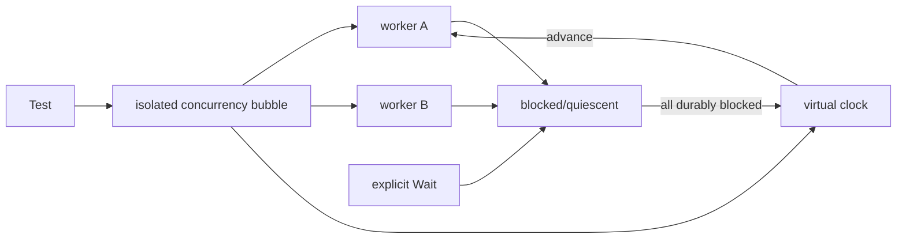

# Deterministic Concurrency Tests, Virtual Time & Quiescence

**Seviye:** Mid → Principal  
**Alan:** Testing Engineering

## Problem
Async testte `Sleep(100ms)` kullanıp background işin tamamlandığını varsaymak correctness'i wall-clock ve scheduler timing'ine bağlar. Sonuç: yavaş CI, gereksiz bekleme ve yük altında flaky test. Daha iyi model zamanı, synchronization'ı ve quiescence'ı kontrol edilebilir hale getirir.

## Mental model

## Virtual time
Fake clock timeout, deadline, retry, debounce ve backoff state machine'lerini gerçek saniyeleri beklemeden test etmeyi sağlar. Ama fake clock tek başına yeterli değildir: assertion'ın background mutation'a göre ne zaman çalıştığını belirleyen explicit synchronization gerekir.

## Quiescence
Quiescence, "goroutine henüz scheduler'da sıra almadı" ile "ilerlemek için zaman/dış olay bekliyor" durumunu ayırmaya çalışır. Deterministic harness'ın amacı tesadüfi wall-clock gecikmesi yerine gözlemlenebilir bir ilerleme sınırı sağlamaktır.

## Go 1.25 `testing/synctest`
Go 1.25'te `testing/synctest` standard library'ye girdi. `synctest.Test` izole bir bubble kurar; bubble'da zaman sanallaştırılır. Uygun durumda tüm goroutine'ler bloklandığında fake clock ileri gidebilir. `synctest.Wait()` background activity'nin quiescent hale gelmesini beklemek için kullanılır. Paket Go 1.24'te deneysel olarak başlamıştı.

Bu API'nin ötesindeki genel ders: **wall-clock sleep yerine controllable time + explicit synchronization + deterministic progress**.

## Race detector ile farkı
Deterministic scheduling/time harness race detector değildir. Race detector unsafe concurrent memory access/happens-before ihlallerini bulmaya çalışır; deterministic harness test orchestration ve timing flakiness'ini azaltır. İkisi tamamlayıcıdır.

## Mülakat soruları
1. Sleep tabanlı async test neden flaky olur?
2. Fake clock hangi bug sınıflarında yüksek değer sağlar?
3. Quiescence ile scheduler starvation farkı nedir?
4. Deterministic harness race detector'ın yerini neden tutmaz?
5. 30 saniyelik retry/backoff testini gerçek süreyi beklemeden nasıl kurarsın?
6. Production API'ye testability abstraction ekleme sınırını nasıl belirlersin?

## Beklenen cevap seviyesi
- **Mid:** sleep/polling flakiness ve fake clock değerini açıklar.
- **Senior:** happens-before, quiescence ve timeout/retry state machine'ini bağlar.
- **Staff:** deterministic harness, CI runtime ve abstraction cost trade-off'unu tasarlar.
- **Principal:** flaky-test bütçesi, concurrency-test standardı ve migration stratejisi oluşturur.

## Alıştırma
1s, 2s, 4s backoff kullanan üç-denemeli retry testindeki `Sleep(7s)` yaklaşımını virtual clock + observable attempt counter ile değiştir. Her assertion için gerekli synchronization boundary'yi belirt.

## Proje
`deterministic-retry-lab`: timeout, exponential backoff, cancellation ve background worker içeren Go service'i önce real sleeps, sonra `testing/synctest` ile test et. CI süresi ve 1.000 tekrar içindeki flaky oranını karşılaştır.

## Failure modes / production bağlantısı
Fake clock kullanırken gerçek network/filesystem gibi kontrol edilmeyen blocking kaynakları unutmak sahte determinism yaratabilir. Aşırı mocking gerçek scheduler/I/O davranışını gizleyebilir. Deterministic unit tests; race detector, stress/integration tests ve production telemetry ile tamamlanmalıdır. Flaky testleri otomatik retry ile gizlemek çözüm değildir.

## Kaynaklar
- Go 1.25 Release Notes: https://go.dev/doc/go1.25
- Go Blog — Testing Time (and other asynchronicities): https://go.dev/blog/testing-time
- Go package docs — `testing/synctest`: https://pkg.go.dev/testing/synctest
