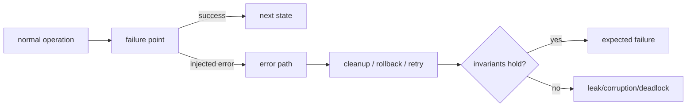

# Fault Injection, Fail-Nth & Error-Path Coverage

## Neden önemli?
Happy-path coverage production reliability kanıtı değildir. Allocation failure, disk I/O error, timeout, short write, connection reset ve partial initialization gibi nadir yollar çoğu sistemde asıl dayanıklılık sınırını belirler. Fault injection bu yolları kontrollü üretir. Hedef rastgele kaos değil, **failure point → beklenen invariant → cleanup/retry/rollback sonucu** zincirini doğrulamaktır.

Linux kernel fault-injection framework `failslab`, `fail_page_alloc`, `fail_make_request`, `fail_futex`, `fail_function` gibi capability'ler sunar. Probability/interval/times ile kampanya yapılabilir; `/proc/<pid>/fail-nth` ise bir operation içindeki N'inci uygun failure point'i sistematik fail ettirerek daha reproducible error-path exploration sağlar.

## Mental model

## İçeride ne oluyor?
- Önce invariant tanımlanır: lock bırakıldı mı, resource leak var mı, partial state görünür mü, retry idempotent mı?
- Probabilistic injection geniş arama sağlar fakat reproducibility için seed/config saklanmalıdır.
- Fail-Nth failure point'leri sırayla gezerek tek operation içinde sistematik exploration sağlar.
- Error-injectable function zorla erken error return aldığında caller'ın varsaydığı geri döndürülemez state mutation bırakmamalıdır.
- Disk fault testinde yalnız `EIO` sonucu değil retry policy, partial completion, consistency ve observability de doğrulanmalıdır.
- Fault injection race detector, sanitizer, property test veya chaos engineering'in alternatifi değildir; farklı bug sınıflarını hedefler.
- Test failure rate'inin production rate ile aynı olması gerekmez; nadir path'i yoğunlaştırıp invariant sınamak daha değerlidir.

## Mülakat soruları
1. %90 line coverage neden error handling kanıtı değildir?
2. Random fault injection ile fail-Nth arasındaki trade-off nedir?
3. Allocation failure sonrası hangi invariant'ları kontrol edersin?
4. Retry testinde idempotency neden kritik?
5. Senior: disk `EIO` ile timeout'u aynı retry policy'ye koymak neden tehlikeli olabilir?
6. Staff/Principal: organization-wide fault-injection standardında reproducibility, blast radius ve CI budget nasıl yönetilir?

## Beklenen cevap seviyesi
- **Mid:** fault point, expected error ve cleanup invariant'ı.
- **Senior:** retryability, idempotency, partial state ve deterministic reproduction.
- **Staff:** CI campaign, failure taxonomy ve observability standardı.
- **Principal:** platform primitive'i, adoption maliyeti, risk tiering ve production-chaos sınırı.

## Mini alıştırma
`open → allocate → read → parse → write temp → fsync → rename` pipeline'ı için en az altı injection point çıkar. Her biri için external result ve cleanup invariant'ını yaz.

## Proje
`failpoint-lab`: küçük storage service'e named failpoint'ler ekle. ENOSPC/EIO/timeout/allocation-failure benzetimleri, invariant assertions, deterministic seed ve CI replay komutu ekle. Random campaign ile systematic fail-Nth yaklaşımını karşılaştır.

## Failure modes / trade-off / production
Yalnız random chaos reproducibility'yi düşürür; yalnız unit-level failpoint gerçek kernel/network davranışını gizleyebilir. Unsafe injection state corruption yaratabilir. Test ortamını production'dan izole et; injected-failure telemetry'sini gerçek incident sinyalinden ayır; CI'da seed/config/artifact sakla.

## Kaynaklar
- Linux Kernel — Fault injection capabilities infrastructure: https://docs.kernel.org/fault-injection/fault-injection.html
- Linux Kernel — NVMe Fault Injection: https://docs.kernel.org/fault-injection/nvme-fault-injection.html
